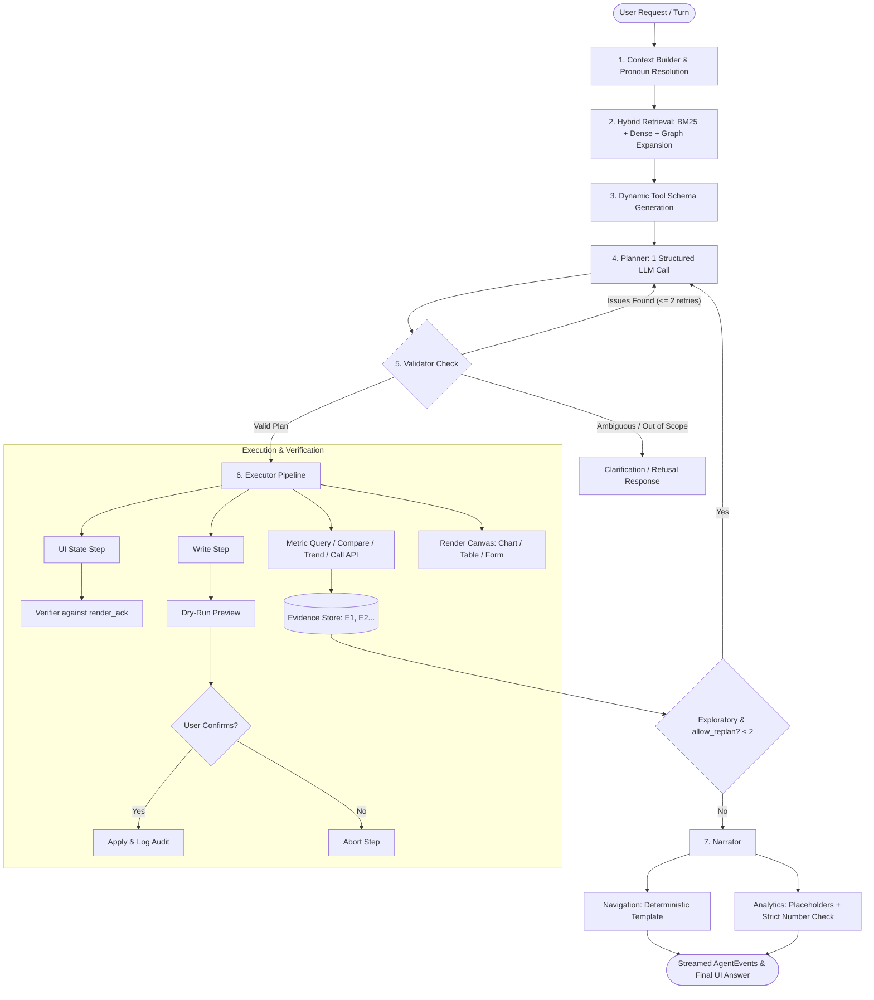

# AppPilot Agent Workflow & Architecture Reference

*Context-Aware Application Agent for Olist Seller Operations (KLE Tech HackFest 2026, Problem Statement 5A).*

Single source of truth for the complete operational lifecycle of the AppPilot agent: from user query ingestion and hybrid retrieval to single-call structured planning, deterministic validation, verified execution, and citation-enforced narration.

---

## 1. Core Principles & Problem Statement Alignment

| Principle | Meaning in AppPilot |
|---|---|
| **Thesis** | *The LLM proposes; deterministic code validates before and verifies after; every number is cited.* |
| **Zero Hardcoding** | No page IDs, widget codes, filter values, or API paths are hardcoded. All come dynamically from `data/olist/application.json` and `GET /api/catalog`. |
| **Non-Circular Verification** | The backend calculates expected UI state; the browser acknowledges what it actually rendered (`render_ack`). The server verifies without trusting model output. |
| **Guarded Writes** | All mutations are performed via catalogue write APIs on `ops_*` tables with dry-run preview, explicit user confirmation, audit logging, and full undo support. |
| **Data Hygiene** | Reviews, ticket notes, and user messages are treated as data, strictly enclosed within untrusted delimiters to prevent prompt injection. |
| **Grounded Placeholders** | The LLM never invents numbers. Analytic answers use placeholders (`{E1.rows[0].value}`) populated by code from verified evidence. |

---

## 2. High-Level Flowchart



---

## 3. End-to-End Sequence Diagram

```mermaid
sequenceDiagram
    autonumber
    actor User
    participant Web as Web App (React)
    participant Agent as Agent Loop (agent.py)
    participant Planner as Planner (planner.py)
    participant Val as Validator (validator.py)
    participant Exec as Executor (executor.py)
    participant Ver as Verifier (verifier.py)
    participant Narr as Narrator (narrator.py)

    User->>Web: "Why was this order late and what is its SLA?"
    Web->>Agent: POST /api/session/{sid}/message
    
    Note over Agent: 1. Ingest context (selected order, active page, filters)
    Note over Agent: 2. Hybrid Retrieval (top-8 pages, top-6 APIs) + Graph Expansion
    
    Agent->>Planner: Prompt (rules, candidate schemas, context, few-shots)
    Planner->>Agent: Plan {intent: explain_change, steps: [read_view, call_api, render_canvas]}
    
    Agent->>Val: validate(plan, current_state)
    Val-->>Agent: ValidationResult (OK)
    
    loop For each step in Plan
        alt UI Step
            Agent->>Exec: apply_state(step)
            Exec->>Web: WebSocket apply_state
            Web-->>Exec: WebSocket render_ack (rows, hash, filters)
            Exec->>Ver: verify(expected_ack, browser_ack)
            Ver-->>Agent: VerifyResult (OK)
        else Analytics Step
            Agent->>Exec: run_metric_query / call_api
            Exec-->>Agent: Evidence created (E1, E2)
        else Write Step
            Agent->>Exec: dry_run preview
            Exec->>Web: confirm_request event
            User->>Web: Approve confirmation
            Web->>Exec: POST /api/session/{sid}/confirm
            Exec-->>Agent: Applied (ACT-xxx logged)
        end
    end
    
    Agent->>Narr: narrate(plan, evidence, user_query)
    Note over Narr: Fills placeholders ({E1.late_days}); scans for ungrounded digits
    Narr-->>Agent: Grounded answer + citations [E1, E2] + deep links
    Agent-->>Web: emit answer & done events
    Web-->>User: Displays live answer, citations, and generated canvas
```

---

## 4. Stage-by-Stage Workflow Details

### Stage 1: Context Ingestion & Reference Resolution (`agent/context.py`)
- **API Call**: Reads `GET /api/session/{sid}/context`.
- **Visible Data**: Extracts current page code (`P-xxx`), route, active filters, selected widget, and the first rows of visible tables.
- **Pronoun & Reference Resolution**:
  - *"Why was this order late?"* $\rightarrow$ Resolves `this order` to the ID of the selected row in `ops.orders`.
  - *"Same for SP"* $\rightarrow$ Carries over metric and dimensions from the previous turn, swapping filter to `customer_state = SP`.
  - *"Restock these items"* $\rightarrow$ Extracts product IDs from the currently visible low-stock alert rows.
- **Sliding History Window**: Maintains last 6 dialogue turns. Older turns are summarized to conserve prompt tokens.

### Stage 2: Hybrid Retrieval & Graph Expansion (`agent/retrieval.py`)
- **Metadata Cards**: 115 pages (15 curated operations + 100 generated reports), 284 widgets, governed metrics, and 41+ APIs are indexed as concise semantic cards.
- **Dual Retrieval Pipeline**:
  - **Lexical (BM25)**: Matches terms using BM25 with business synonym normalization (e.g., "sales" $\leftrightarrow$ "revenue", "Rio" $\leftrightarrow$ "RJ", "delayed" $\leftrightarrow$ "late").
  - **Dense Vectors**: Semantic vector similarity over titles, descriptions, and keywords.
- **Reciprocal Rank Fusion (RRF)**: Merges ranks with constant $k=60$:
  $$RRF(item) = \sum_{m \in \{lexical, dense\}} \frac{1}{60 + rank_m(item)}$$
- **Knowledge Graph Expansion (`networkx`)**:
  - Traverses `Module` $\rightarrow$ `Page` $\rightarrow$ `Widget` $\rightarrow$ `Dataset` $\rightarrow$ `Metric` $\rightarrow$ `API`.
  - Adds related sibling pages and bound APIs into candidates (toggled by `AgentConfig.use_graph_expansion`).
- **Output Bounds**: Top 8 pages and top 6 APIs with complete schemas are passed to the planner.

### Stage 3: Dynamic Tool Schema Assembly (`agent/tools.py`)
- Generates JSON schemas for the 15 standard tools defined in `contracts/actions.py`.
- Constrains arguments using runtime enums:
  - `page_id`: Only valid candidate pages.
  - `filters`: Only valid filter IDs for the target page; categorical values constrained to closed sets.
  - `preset`: Only supported date presets (`last_month`, `last_quarter`, `last_12_months`, etc.).
  - `write_api`: Parameters and body schemas strictly mirrored from `/api/catalog`.

### Stage 4: Single-Call Structured Planning (`agent/planner.py`, `agent/llm.py`)
- **Efficiency Constraint**: **Exactly one structured LLM call** to determine both user intent and multi-step plan.
- **Gemini Adapter**:
  - Uses `google-genai` SDK with Pydantic structured output.
  - Uses a flattened step schema (`tool` enum, `args_json` string, `expect_json` string) to circumvent Gemini's nested free-form schema limitations.
- **Disk Caching (`.llm_cache/`)**: SHA-256 hash of `(model, messages, schema)`. Identical queries return instantaneously with zero API cost.
- **Intent Categorization**:
  - Standard operations: `navigate`, `set_state`, `read_view`, `analyze_trend`, `compare_periods`, `explain_change`, `multi_step`.
  - Guardrails: `clarify_needed` (returns 2–3 options), `out_of_scope` (honest refusal), `unsafe_action` (rejected mutation).

### Stage 5: Deterministic Validation & Repair Loop (`backend/validator.py`)
- **Pre-execution Verification**: Every proposed plan is validated against `application.json` and `/api/catalog` before any execution occurs.
- **Checks Performed**:
  - Page IDs, filter IDs, and categorical values exist.
  - Presets and metric/dimension names match the semantic layer.
  - Write step limit ($\le 5$ writes per plan, otherwise bulk API required).
- **Self-Correction Loop**: If validation fails, returned `ValidationIssue`s and suggestions are fed back to the planner (maximum 2 retries). If still invalid, asks the user.

### Stage 6: Execution, Human Confirmation & UI Verification (`backend/executor.py`)
- **UI Steps**: Updates `UiState`. Verified against the browser's `render_ack` (route, filter array, row count, and series hash).
- **Read & Analytics Steps**: Runs metric queries, decompositions, or summary APIs; saves results as evidence (`E1`, `E2`, ...).
- **Write Steps**:
  1. Dry-run executed on backend $\rightarrow$ returns change preview.
  2. Emits `confirm_request` event with before/after diffs to UI.
  3. Pauses execution awaiting explicit user approval.
  4. Upon approval, applies mutation to `ops_*` tables and records action in `ops_action_log`.
  5. Mutation is immediately undoable via `/api/session/{sid}/undo`.
- **Canvases**: Renders generated charts, tables, or schema-driven forms when existing pages do not satisfy the request.

### Stage 7: Bounded Replan & Citation-Checked Narration (`agent/narrator.py`)
- **Bounded Replan**: For exploratory analytics with `allow_replan = true`, planner may be re-invoked with gathered evidence (maximum 2 replans). Previously verified UI steps are never repeated.
- **Narration**:
  - **Navigation/Filters**: Zero LLM calls. Deterministic templates guarantee zero hallucination.
  - **Analytics**: LLM produces text containing placeholders (e.g., `{E1.pct_change}`).
  - **Deterministic Placeholder Filling**: Python fills numbers and units from evidence records.
  - **Strict Citation Check**: Scans response text for digits. If any ungrounded digit is detected, output is rejected and replaced with a structured template.
- **Final Output**: Emits `answer` with evidence citations (`[E1]`) and verified deep links.

---

## 5. Event Stream Reference (`AgentEvent`)

Events stream over WebSocket (`/ws/{sid}`) and are logged in `GET /api/session/{sid}/events`:

| Event Type | Payload Content | UI Representation |
|---|---|---|
| `understanding` | `intent`, recognized entities/slots | Assistant reasoning step |
| `retrieval` | Candidate pages and APIs with relevance scores | Retrieved context badges |
| `plan` | Step list with tools, arguments, and expectations | Plan checklist |
| `validation` | Status (`ok` or issue list) | Validator badge |
| `confirm_request` | Action ID, summary, before/after diff preview | Confirmation modal / card |
| `action` | Step index, tool name, status (`running`, `done`, `failed`) | Execution progress icon |
| `verify` | Screen verification result (`ok`, mismatches, source) | Green "Screen verified" badge |
| `evidence` | Evidence ID (`E1`), kind, rows, source dataset | Evidence pill with view link |
| `canvas` | Canvas ID (`CV1`), kind (`chart`, `table`, `form`), spec | Dynamic canvas component |
| `answer` | Answer text, citations list, deep links | Final assistant bubble |
| `done` | Total steps, replan count, elapsed time | Completed execution footer |

---

## 6. Directory Map (`agent/`)

```
agent/
├── __init__.py
├── llm.py            # Gemini adapter (google-genai), structured output, disk cache, FakeLLM
├── tools.py          # Dynamic tool schemas generated from Application and API catalogue
├── retrieval.py      # BM25 + dense vector hybrid retrieval + networkx graph expansion
├── context.py        # Session context reader, conversation memory, pronoun resolution
├── planner.py        # 1-call prompt assembly, structured plan generation, repair loop
├── agent.py          # Master orchestrator loop, streaming async events, replan, recovery
├── narrator.py       # Deterministic navigation templates, placeholder filler, number check
└── baselines.py      # B0 (LLM only), B1 (prompt stuffing), B2 (RAG + tools without gates)
```
