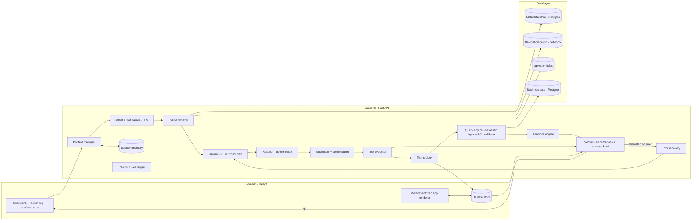
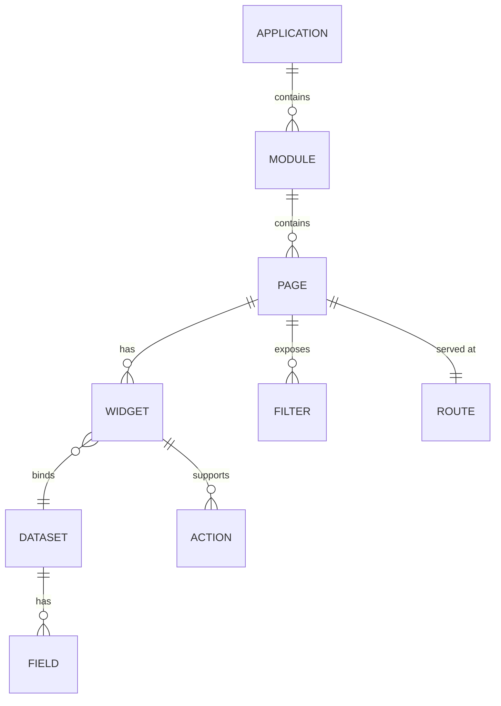
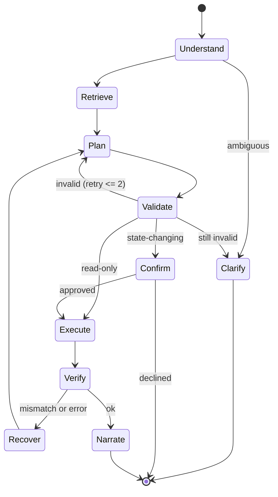
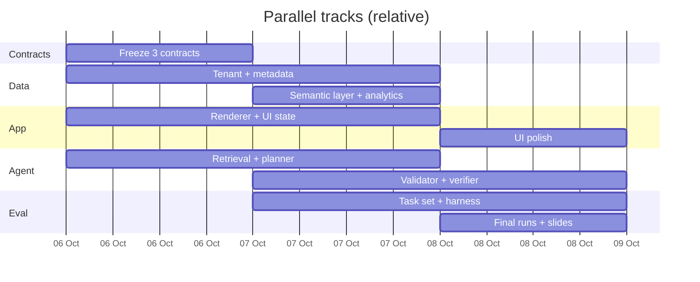

# 5A — Context-Aware Application Agent
## Official Pre-Implementation Research & Planning Document

**Event:** KLE Tech HACKFEST 2026 · **Domain 5** · **Problem Statement 5A**
**Document status:** Single source of truth before implementation begins
**Prepared:** 6 Oct 2026 · **Online review (per team):** 9 Oct 2026

### How to read this document — source tags

Every claim carries one of these tags so the team always knows how much to trust it.

| Tag | Meaning |
|---|---|
| **[RB]** | From the official HackFest rulebook / poster / 5A page (the three pages the team supplied). |
| **[PUB]** | Published research, dataset or official documentation, confirmed in web searches run on 6 Oct 2026. Links given. |
| **[SEC]** | Reported by a secondary source (blog, comparison site, leaderboard page). Treat as indicative; check the vendor's own docs before quoting. |
| **[MEM]** | From the author's background knowledge, **not re-verified** in this session. Re-check before putting on a slide. |
| **[INF]** | Our own inference or recommendation. Not published fact. |

**Honesty note.** Research was done through ~20 web searches, mostly reading search-result summaries, not full papers. Numbers marked [PUB] come from those summaries and should be spot-checked against the paper before you quote them to judges. Nothing in this document is invented; where we lack information it says so.

---

# Table of Contents

1. Project Overview
2. Official Problem Statement Analysis
3. Problem Decomposition
4. Research & Literature Survey
5. Existing Systems / Competitor Analysis
6. Dataset & Benchmark Analysis
7. Custom Dataset / Benchmark Design
8. Research Gap & Novelty
9. Proposed Solution
10. Proposed Architecture
11. Application / Environment Design
12. Metadata & Knowledge Representation
13. Agent Architecture
14. Data & Query Architecture
15. Evaluation Framework
16. Baselines & Ablation Studies
17. Technology Stack
18. Implementation Roadmap
19. Hackathon MVP
20. Team Structure
21. Demo Strategy
22. Risk & Failure Analysis
23. Judge Questions & Answers
24. Final Winning Strategy
25. Pre-Implementation Checklist
26. Final One-Page Summary

---

# 1. Project Overview

## 1.1 Hackathon facts [RB]

| Item | Value |
|---|---|
| Event | KLE Tech HACKFEST 2026 ("Mentored by Alumni, Powered by Students") |
| Domain | **5 — Context-Aware Application Agent & Dynamic Pricing Engine** (poster title); the 5A page titles it *Enterprise Applications, Agentic AI & Dynamic Pricing* |
| Problem statement | **5A — Context-Aware Application Agent** |
| Scale | 17 problem statements across 6 domains; ₹1,75,000 total prize money |
| Team | 4–6 members, any branch |
| Extras | Students get internship opportunities with industry partners |
| Schedule on poster | Online hackathon 7–8 Oct 2026; offline hackathon 9 Oct 2026 |
| Schedule used in this plan | Team states the **online review is on 9 Oct**. The poster lists 9 Oct as offline. **Action: confirm with organizers whether the build window and the review fall on the same days** (see §25). |

## 1.2 Problem statement summary [RB]

Build an intelligent, context-aware assistant that understands an entire **no-code business application** — its navigation hierarchy, pages, widgets, data views, filters and charts — and lets users **navigate, operate and analyze** it through natural language. It must go beyond a chatbot: determine user intent, act on the application (navigate to the right page, configure filters and UI state), retrieve and combine data, reason analytically (trends, period comparisons, likely causes), and present answers in context.

## 1.3 Project objective [INF]

Deliver a working agent plus a **measured benchmark** showing it routes to the right page, sets the exact UI state, answers analytical questions correctly with cited evidence, and refuses or recovers when it cannot — scored against the nine official KPIs.

## 1.4 Overall vision [INF]

An in-app companion that a business user can talk to instead of clicking through menus, and that **shows its work**: every action is visible, validated against the application's own metadata, verified against the live UI, and every number is traceable to a view or query.

## 1.5 Winning thesis (one line) [INF]

> *A metadata-grounded in-app agent whose every action is validated before it runs and verified after it runs, and whose every number is cited — measured on a benchmark aligned to the official KPIs.*

---

# 2. Official Problem Statement Analysis

## 2.1 Exact problem interpretation [INF, based on RB]

The statement describes a **UI-operating analytical agent**, not a Q&A bot. Three things must happen from one utterance:

1. **Understand** what the user wants (intent + slots) in the context of this specific application.
2. **Act** on the application's UI state (page, filters, date range, sort) — and confirm before state changes.
3. **Analyze** the underlying business data and explain the result, grounded in views the user can see.

The rulebook assumes a **no-code platform export** (metadata for pages, widgets, filters). **No target application is supplied** — the dataset section says "exported from the no-code platform" and allows "synthetic or sample tenants where production data is sensitive". We therefore must supply the application and its metadata ourselves.

## 2.2 Explicit requirements [RB]

| # | Requirement |
|---|---|
| E1 | Understand the whole app: navigation hierarchy, pages, widgets, data views, filters, charts. |
| E2 | Natural-language navigation, operation and analysis. |
| E3 | Determine user intent (not just chat). |
| E4 | Act on the app: navigate, configure filters and UI state. |
| E5 | Retrieve and combine data. |
| E6 | Reason analytically: trends, period comparisons, likely causes. |
| E7 | Present answers in context. |
| E8 | Suggested data: app metadata, component/UI-state definitions, underlying business data (synthetic acceptable), NL-request corpus (intent + slot annotations), public grounding/benchmarks (UI-understanding, text-to-SQL, RAG evaluation). |
| E9 | Suggested stack: metadata store + knowledge graph; vector index (FAISS/Milvus/pgvector); LLM planning with LangChain/LlamaIndex tool calling; semantic search/RAG; text-to-query; multi-step reasoning; agent controller with tool calls for routes, filters, dates, sorting, component data; Playwright where no direct APIs; guardrails and confirmation for state changes; embedded conversational companion; dynamic charts, summary cards, comparisons; deep-link navigation; human-in-the-loop review; clear explanation of actions. |

## 2.3 Implicit requirements [INF]

| # | Implicit expectation | Why we infer it |
|---|---|---|
| I1 | A **runnable target application** with real UI state we can read and write. | KPIs measure UI-state correctness; that needs observable state. |
| I2 | A **labelled test set** with numbers. | Nine quantitative KPIs imply judges expect measurements. |
| I3 | **Scale-aware retrieval.** | KPI says "hundreds of pages and components" — prompt-stuffing will not scale. |
| I4 | **Visible human-in-the-loop** on state changes. | Explicit in the stack; demos well. |
| I5 | **Traceability** of answers to views. | KPI: "answers traceable to supporting views". |
| I6 | **Graceful refusal** for out-of-scope or missing data. | KPI: "near-zero action hallucination". |
| I7 | **Generalization** to another tenant/app. | "Platform's metadata" implies the agent should work on any export, not one hard-coded app. |
| I8 | Latency fit for conversation. | KPI lists response latency. |

## 2.4 Expected capabilities [INF]

Navigate by intent · set filters / date ranges / sort · read widget data · run structured queries · compare periods · explain trends and likely causes with evidence · chain multiple steps · ask clarifying questions · confirm before changing state · explain every action taken · recover from errors · refuse unsafe or unsupported requests.

## 2.5 Constraints [RB + INF]

| Constraint | Source |
|---|---|
| 4–6 member team, any branch | [RB] |
| ~3 working days to review (6→9 Oct) | team statement |
| No production data; synthetic tenant acceptable | [RB] |
| Must use the metadata-driven approach (not an arbitrary website) | [RB] implied |
| Student budget: free/cheap tooling, limited LLM spend | [INF] |
| LLM latency and API reliability during live demo | [INF] |

## 2.6 Official KPIs [RB]

| # | KPI (as written in the rulebook) |
|---|---|
| K1 | **Intent-to-destination accuracy** — % of requests routed to the correct page, report, grid or dashboard. |
| K2 | **UI-state correctness** — % of filters, date ranges and sorts configured correctly. |
| K3 | **Task-success rate** for multi-step (agentic) requests; average steps and latency to a useful result. |
| K4 | **Analytical quality** — correctness of trends/comparisons and explanation faithfulness (answers traceable to supporting views). |
| K5 | **Retrieval quality** over application metadata (precision / recall / MRR) at scale — hundreds of pages and components. |
| K6 | **Reliability and safety** — near-zero action-hallucination rate, error/recovery rate, response latency. |
| K7 | **User experience** — task completion without manual navigation; perceived usefulness as an in-app companion. |

## 2.7 Basic vs strong vs winning [INF]

| Tier | What it looks like | Typical score profile |
|---|---|---|
| **Basic** | RAG chatbot over page descriptions; returns a link or a text answer. | Passes K1 partially; no K2/K3/K6 evidence. |
| **Strong** | Tool-calling agent that navigates, sets filters, runs SQL, draws charts; some testing. | K1, K2 decent; K6 unmeasured; analytics sometimes unfaithful. |
| **Winning** | Strong + deterministic validation before every action + live UI-state verification after + cited analytics with refusal on missing data + a labelled benchmark with baselines/ablations + second-tenant generalization + a demo that visibly catches a bad action. | All KPIs measured, with evidence and honest limitations. |

---

# 3. Problem Decomposition

Each challenge lists the technical question, the design answer we adopt [INF], and the KPI it affects.

| # | Challenge | Core question | Our answer (detail in later sections) | KPI |
|---|---|---|---|---|
| 1 | **Application understanding** | How does the agent know what the app contains? | Ingest the metadata export into a typed store + navigation graph; embed descriptions (§12, §14). | K1, K5 |
| 2 | **Context understanding** | What page/filters is the user on right now? "Compare it with last quarter" refers to what? | Context manager holding the current UI state + recent turns + resolved entities (§13). | K2, K3 |
| 3 | **Intent detection** | Navigate, filter, analyze, compare, explain, or out-of-scope? | LLM structured-output classifier with a closed intent set + slot extraction (§13). | K1 |
| 4 | **Navigation** | How to reach the right page without inventing URLs? | Retrieval → candidate page IDs → route registry resolves ID to route. LLM never writes URLs. | K1, K6 |
| 5 | **UI-state manipulation** | How to set filters/date/sort exactly? | Typed tools bound to per-page filter schemas; values normalized (e.g., "last quarter" → date range) by deterministic code. | K2 |
| 6 | **Metadata retrieval** | How to find the right pages/widgets among hundreds? | Hybrid: vector search + keyword + graph expansion, then rerank (§14). | K5 |
| 7 | **Data retrieval** | How to get numbers safely? | Semantic layer of named metrics/dimensions; read-only SQL, validated (§14). | K4 |
| 8 | **Analytical reasoning** | How to compute trends/comparisons/likely causes honestly? | Deterministic analytics (deltas, contributions, decomposition) computed in code; LLM only narrates, with citations (§13, §14). | K4 |
| 9 | **Multi-step execution** | How to chain navigate → filter → query → compare? | Planner emits a typed plan; executor runs steps; state flows between steps. | K3 |
| 10 | **Verification** | How do we know the action took effect and the answer is right? | Pre-action validator + post-action UI-state read-back + answer-citation check. | K2, K4, K6 |
| 11 | **Error recovery** | What when a filter value is invalid, a page is missing, or a query fails? | Typed errors returned to the planner, bounded retries, then clarification. | K6 |
| 12 | **Memory** | How to handle follow-ups and preferences? | Session memory: UI state, last N turns, resolved references. No long-term learning in MVP. | K3, K7 |
| 13 | **Safety / guardrails** | How to prevent unauthorized or destructive actions? | Read-only default, allowlisted tools, confirmation on state changes, refusal policy. | K6 |

---

# 4. Research & Literature Survey

**Scope and limits.** This is a *targeted* survey (about 20 searches), not an exhaustive one. It covers the categories requested. Where a field is blank it means we did not verify it. Several categories (planning, KGs, verification) are thinner than others and are marked. Nothing here should be cited as "state of the art" beyond what the entries say.

For each paper: **Title · Year/Venue · Link · Core idea · Method · Dataset · Results · Limitations · Relevance · Lessons.**
Limitations, relevance and lessons are our assessment [INF] unless stated.

## 4.1 Agentic AI (reasoning + acting)

### ReAct: Synergizing Reasoning and Acting in Language Models
- **Year/Venue:** ICLR 2023 [PUB]. **Link:** <https://arxiv.org/abs/2210.03629>
- **Core idea:** Interleave verbal reasoning traces with actions so the model plans, acts, observes and adjusts. [PUB]
- **Method:** Few-shot prompting with Thought/Action/Observation turns. [PUB]
- **Datasets:** HotPotQA, FEVER, ALFWorld, WebShop. [PUB]
- **Results:** On ALFWorld and WebShop, outperformed imitation and RL methods by an absolute 34% and 10% success rate with only one or two in-context examples. [PUB]
- **Limitations:** No built-in verification; can loop or drift; originally prompt-based, not schema-constrained. [INF]
- **Relevance:** The base loop our agent builds on; also how Salesforce's Atlas engine is described (§5). [SEC]
- **Lesson:** Keep the loop, but wrap each action with deterministic validation and verification.

### Reflexion: Language Agents with Verbal Reinforcement Learning
- **Year/Venue:** NeurIPS 2023 [PUB]. **Link:** <https://proceedings.neurips.cc/paper_files/paper/2023/hash/1b44b878bb782e6954cd888628510e90-Abstract.html>
- **Core idea:** Agents reflect verbally on task feedback and keep the reflection in an episodic memory buffer for later trials. [PUB]
- **Method:** Feedback (scalar or free-form, external or internal) → reflection text → memory → next attempt. [PUB]
- **Datasets:** Sequential decision-making, coding, language reasoning. [PUB]
- **Results:** 91% pass@1 on HumanEval vs 80% for GPT-4 baseline. [PUB]
- **Limitations:** Needs a good feedback signal; improves over repeated trials, which a single live request does not have. [INF]
- **Relevance:** Informs our bounded retry-with-error-feedback recovery loop.
- **Lesson:** Feed *concrete, typed* error messages back to the planner; don't ask it to "try again".

## 4.2 GUI / Web agents

### Mind2Web (and its multimodal variant) / SeeAct — *GPT-4V(ision) is a Generalist Web Agent, if Grounded*
- **Year/Venue:** SeeAct: ICLR/ICML 2024 [PUB]; Mind2Web: NeurIPS 2023 [MEM]. **Link:** <https://arxiv.org/pdf/2401.01614>
- **Core idea:** Use a large multimodal model to follow NL instructions on live websites. [PUB]
- **Method:** Plan in text, then ground the plan to page elements; also an online evaluation tool for live sites. [PUB]
- **Datasets:** Mind2Web — about 2,000 tasks across real sites [PUB]; the multimodal version pairs HTML with screenshots (7,775 actions from 1,009 training tasks) [PUB, secondary].
- **Results:** GPT-4V completed 51.1% of live tasks **if** textual plans were manually grounded; it beat text-only GPT-4 and fine-tuned smaller models. [PUB]
- **Limitations:** Grounding the plan to elements remains the main failure. [PUB]
- **Relevance:** Strong evidence that screen/DOM grounding is the weak link. Our approach avoids it by acting through a typed state API driven by metadata.
- **Lesson:** Do not make free-form DOM clicking the primary path.

### WebArena / VisualWebArena / OSWorld / AndroidWorld
- **Year/Venue:** various [MEM]. **Link:** survey index: <https://arxiv.org/pdf/2411.18279>
- **Core idea:** Executable, outcome-checked environments for web/desktop/mobile agents. [PUB, survey-level]
- **Details reported in search results [SEC]:** AndroidWorld has 116 tasks over 20 apps; a corrected OSWorld release has 369 tasks; scores on WebArena differ by 20–30 points with the scaffold.
- **Limitations:** Heavy to run; wrong domain for our metadata-driven app.
- **Relevance:** Model for *how to report* results (outcome-based, scaffold stated). Not for running.
- **Lesson:** Always state the scaffold/prompt used; results are scaffold-sensitive.

### LLM-Brained GUI Agents: A Survey
- **Year:** 2024 (arXiv) [PUB]. **Link:** <https://arxiv.org/pdf/2411.18279>
- **Core idea:** Survey of GUI agents. **Relevance:** Entry point for further reading; we did not read it in full.

## 4.3 Enterprise agents

### WorkArena: How Capable Are Web Agents at Solving Common Knowledge Work Tasks?
- **Year/Venue:** ICML 2024 [PUB]. **Link:** <https://arxiv.org/pdf/2403.07718>
- **Core idea:** Benchmark of everyday enterprise-software tasks on ServiceNow, plus the **BrowserGym** environment. [PUB]
- **Method:** Browser-based agents observe pages (text and multimodal) and act through a rich action set. [PUB]
- **Dataset:** 33 task types with 19,912 unique instances: filtering lists, filling forms, searching knowledge bases, service catalogs, **reading dashboards**, **navigating menus**. [PUB]
- **Results:** GPT-4o reached 42.7%; a considerable gap to full automation remains. [PUB]
- **Limitations:** Requires ServiceNow; browser-level control is brittle on enterprise UIs. [INF]
- **Relevance:** **Closest published analogue to 5A.** Its task taxonomy (list filter, dashboard read, navigate) maps directly to our task types.
- **Lesson:** Cite as motivation. Borrow task categories. Contrast: we act through app state, not raw DOM.

### Beyond Accuracy: A Multi-Dimensional Framework for Evaluating Enterprise Agentic AI Systems (CLEAR)
- **Year:** 2025 (arXiv) [PUB]. **Link:** <https://arxiv.org/html/2511.14136v1>
- **Core idea:** Evaluate enterprise agents on five dimensions — cost, latency, efficiency, assurance, reliability — with pass@k-style reliability metrics; includes a gap analysis of 12 benchmarks. [PUB]
- **Limitations:** Position/framework paper, not a system. [INF]
- **Relevance:** Justifies reporting latency, steps and consistency next to accuracy.
- **Lesson:** Include cost per task and pass^k in our evaluation.

## 4.4 Tool-using LLMs

### Gorilla: Large Language Model Connected with Massive APIs
- **Year/Venue:** NeurIPS 2024 [PUB]. **Link:** <https://ar5iv.labs.arxiv.org/html/2305.15334>
- **Core idea:** Fine-tune an LLM for accurate API calls; retriever-aware training lets it adapt to changed documentation at test time. [PUB]
- **Dataset:** APIBench (HuggingFace, TorchHub, TensorHub APIs). [PUB]
- **Results:** Surpassed GPT-4 on writing API calls. [PUB]
- **Limitations:** Needs fine-tuning; API-doc domain, not UI. [INF]
- **Relevance:** Supports retrieving tool/page descriptions at run time so the agent follows metadata changes without retraining.

### ToolLLM: Facilitating LLMs to Master 16000+ Real-World APIs
- **Year:** 2023 (arXiv); venue ICLR 2024 [MEM]. **Link:** <https://arxiv.org/pdf/2307.16789>
- **Core idea:** Scale tool use to 16,000+ real REST APIs with multi-step tool chains. [PUB]
- **Relevance:** Evidence that tool *retrieval* is needed once tool/page sets are large — our "hundreds of pages" problem.

### Berkeley Function Calling Leaderboard (BFCL)
- **Year/Venue:** ICML 2025 [PUB]. **Link:** <https://gorilla.cs.berkeley.edu/leaderboard>
- **Core idea:** Standard function-calling evaluation using AST matching; includes relevance detection (abstaining) and multi-step stateful settings. [PUB]
- **Dataset (as reported):** 1,680 Python, 100 Java, 50 JavaScript, 70 REST, 100 SQL items across simple/parallel/multiple/executable scenarios. [PUB]
- **Limitations:** Single-turn is largely solved; memory and long-horizon remain open. [PUB]
- **Relevance:** Use it to *choose* the LLM; borrow the "abstain when no tool fits" idea for our hallucination metric.

## 4.5 Planning

We found no planning paper beyond ReAct that we verified in this session. Plan-and-execute and decomposition methods exist in the literature [MEM] but are **not reviewed here**. Our planner design (§13) is an engineering decision, not derived from a verified paper. **Open item:** if time permits, one team member should read one planning paper (e.g., plan-and-execute/ReWOO-style) before 9 Oct.

## 4.6 RAG

### Gorilla / ToolLLM (retrieval for tools) — see §4.4.
### GraphRAG — see §4.7.

General RAG foundations (Lewis et al., 2020) are **[MEM]** and not reviewed. For our purposes RAG means: embed page/widget descriptions, retrieve candidates, then validate. Retrieval quality is measured directly (K5).

## 4.7 Knowledge graphs

### From Local to Global: A Graph RAG Approach to Query-Focused Summarization
- **Year:** 2024 (arXiv, Microsoft Research) [PUB]. **Link:** <https://arxiv.org/pdf/2404.16130>
- **Core idea:** Build an entity graph from a corpus, summarize communities, answer global questions by map-reduce over community summaries. [PUB]
- **Results:** Substantial gains over vector RAG in comprehensiveness and diversity of answers on global questions. [PUB]
- **Limitations:** Heavy entity extraction cost; targets corpus summarization, not UI navigation. [INF]
- **Relevance:** Our metadata is *already* a hierarchy (directory → page → widget → filter), so we need no entity extraction — only graph expansion for neighbors.
- **Lesson:** Use a lightweight graph to expand retrieval to related pages/widgets; skip full GraphRAG.

## 4.8 NL-to-SQL / data agents

### BIRD — Can LLM Already Serve as a Database Interface?
- **Year/Venue:** NeurIPS 2023 [PUB]. **Link:** <https://neurips.cc/virtual/2023/poster/73529>
- **Core idea:** Large-scale, value-aware text-to-SQL emphasizing dirty values, external knowledge and SQL efficiency. [PUB]
- **Dataset:** 12,751 text-SQL pairs, 95 databases, 33.4 GB, 37 domains. [PUB]
- **Results:** GPT-4 reached 54.89% execution accuracy with curated external-knowledge evidence and 34.88% without. [PUB]
- **Relevance:** The with/without-evidence gap is direct support for giving our SQL generator **metric definitions (a semantic layer)**.

### Spider 2.0: Evaluating Language Models on Real-World Enterprise Text-to-SQL Workflows
- **Year/Venue:** arXiv 2024; ICLR 2025 [MEM]. **Link:** <https://arxiv.org/abs/2411.07763>
- **Dataset:** 632 real enterprise workflow problems across cloud systems and dialects. [PUB]
- **Results:** Code agents solved ~21.3% vs 91.2% on Spider 1.0 and 73.0% on BIRD (as reported). [PUB]
- **Relevance:** Calibrates expectations; reason to constrain SQL through a semantic layer and metrics rather than free schemas.

### Further reading surfaced (not reviewed)
- *Arming Data Agents with Tribal Knowledge* — <https://arxiv.org/pdf/2602.13521> [PUB title only]
- *Agentic-SQL Revisited* — <https://arxiv.org/pdf/2608.15389> [PUB title only]
Both are relevant to data-agent design; **we have not read them** and do not use their claims.

## 4.9 Agent verification and self-correction

### CRITIC: Large Language Models Can Self-Correct with Tool-Interactive Critiquing
- **Year/Venue:** ICLR 2024 [PUB]. **Link:** <https://arxiv.org/pdf/2305.11738>
- **Core idea:** Generate, then verify with external tools, then correct; repeat until a stop condition. [PUB]
- **Datasets:** Free-form QA, math program synthesis, toxicity reduction. [PUB]
- **Limitations:** Evaluated on text tasks, not app UIs. [INF]
- **Relevance:** Best published backing for our **UI-state read-back verifier**: critique driven by an *external* signal (the live state), not the model's opinion.

### Guardrails and tool-safety work (schema/argument enforcement)
Relevant recent work surfaced in search; **we read summaries only**.
- **ToolSafe** — step-level guardrail and feedback for tool invocation safety. <https://arxiv.org/html/2601.10156v1> [PUB]
- **GuardianAgentBench** — benchmark including argument validation via schema/context compliance. <https://www.themoonlight.io/de/review/guardianagentbench-where-agents-fail-and-how-to-guard-them> [SEC review]
- **Closed-World Resolution Against Tool Hallucination in LLM Agents** — <https://arxiv.org/pdf/2609.19425> [PUB]
- **TraceSafe-Bench** — mid-trajectory safety benchmark, 12 risk categories, 1,000+ instances (as reported); arXiv ID returned by search was 2604.07223 — **verify the ID before citing**. [SEC]
- **Symbolic guardrails** — precondition checks on tool calls, schema enforcement, least privilege [SEC].
- **Relevance:** This body of work means **schema-based action validation is not novel by itself** (see §8). It is established practice we apply to app navigation and UI state.

## 4.10 Agent evaluation

### τ-bench: A Benchmark for Tool-Agent-User Interaction in Real-World Domains
- **Year:** 2024 (arXiv) [PUB]. **Link:** <https://arxiv.org/pdf/2406.12045>
- **Core idea:** Simulated user + domain API tools + policy rules; evaluate by comparing **final database state to a goal state**; introduces **pass^k** reliability. [PUB]
- **Results:** gpt-4o succeeded on under 50% of tasks; pass^8 under 25% in retail. [PUB]
- **Limitations:** Airline/retail domains; no UI state. [INF]
- **Relevance / Lesson:** Adopt **state-based scoring** and **pass^k**. Our "state" = UI state + (read-only) data state.

### BFCL, CLEAR, WorkArena — see §4.3–4.4.

## 4.11 UI understanding (reference only)
- **Rico** — 72k app screens from 9.7k Android apps [PUB]; **ScreenQA** — 86K QA pairs over Rico [PUB]: <https://arxiv.org/pdf/2209.08199>; **ScreenSpot** — 1,272 instructions for GUI grounding [PUB, secondary].
- Useful background on screen understanding; not used, because our application exposes structured metadata rather than screenshots.

## 4.12 Survey takeaways [INF]

| Finding | Implication for us |
|---|---|
| Raw GUI/DOM agents are brittle (SeeAct 51.1% with manual grounding; WorkArena GPT-4o 42.7%). | Act through typed state API and metadata, not free-form clicking. |
| Reliability drops sharply over repeated trials (τ-bench pass^k). | Report pass^k; do not report single-run only. |
| Text-to-SQL is hard on real schemas (BIRD ~35–55% GPT-4; Spider 2.0 ~21%). | Semantic layer, constrained queries, deterministic analytics. |
| Self-correction works when grounded in external tool feedback (CRITIC). | Verify against live UI state and SQL results. |
| Schema/argument guardrails already exist in the literature. | Don't over-claim novelty on validation (§8). |
| No paper found that targets *agents over a no-code app's metadata graph with UI-state control*. | Possible gap — **but our search was light; claim cautiously.** |

---

# 5. Existing Systems / Competitor Analysis

**Sourcing caveat.** Descriptions below come from vendor documentation snippets and secondary comparison articles returned by search [SEC], not hands-on testing. Check each vendor's official docs before quoting a limitation to a judge.

| System | What it does | Approach (as reported) | Strengths | Limitations (as reported) | Our differentiation |
|---|---|---|---|---|---|
| **Microsoft Copilot for Power BI** | NL questions, report/page summaries, DAX help | Operates on Fabric-managed semantic models under Power BI security (RLS) | Tight integration; respects row-level security | Limited to what the model exposes; cannot combine datasets or fix model design; docs warn it can fill missing data with plausible answers [SEC] | Provenance on every number; explicit refusal on missing data; works from app metadata, not one vendor's model |
| **Tableau Pulse / Tableau Agent** | Metric digests, NL Q&A | Insight generation over defined metrics | Good single-question insights | Reported as stronger at discrete single-intent queries than multi-step decomposition; tied to Salesforce ecosystem [SEC] | Multi-step *operate-the-app* tasks, UI-state control |
| **Salesforce Agentforce (Atlas Reasoning Engine)** | Agents with topics and actions | Reason–act–observe loop; guardrails via Einstein Trust Layer [SEC] <https://salesforceben.com/introducing-atlas-the-brain-behind-salesforce-agentforce/> | Enterprise governance; action framework | Bound to Salesforce metadata/actions | Platform-agnostic ingestion of an app export |
| **ServiceNow Now Assist AI Agents / AI Agent Studio** | Agents = LLM instructions + tools; agentic workflows | Configured in AI Agent Studio <https://www.servicenow.com/docs/r/intelligent-experiences/ai-agent-landing-page.html> [PUB docs] | Deep platform integration | Platform-bound | Same as above; generic metadata contract |
| **Open-source: browser-use, LangGraph, LlamaIndex agents, Playwright MCP, Vanna/WrenAI** | General agent loops, browser control, text-to-SQL | Varied | Free, flexible | No app-aware navigation graph or UI-state verification [MEM, unverified] | We combine retrieval, typed state tools and verification in one measured system |

## Comparison summary [INF]

| Capability | Vendor copilots | Raw browser agents | **Ours** |
|---|---|---|---|
| Works across arbitrary app export | ✗ (platform-bound) | ✓ | ✓ |
| Actions validated against app metadata | partial | ✗ | ✓ |
| Post-action UI-state verification | unknown | ✗ | ✓ |
| Cited analytics + refusal on missing data | partial | ✗ | ✓ |
| Published KPI benchmark | ✗ | partial (WorkArena etc.) | ✓ (ours, synthetic) |

**Differentiation in one sentence:** vendor copilots are bound to their own platform; browser agents are brittle; we act through a typed, metadata-validated state API and verify the result.

---

# 6. Dataset & Benchmark Analysis

**Availability/license note.** We did not verify licenses in this session. For every dataset, **check the repository license before use** (marked "verify").

| Dataset / Benchmark | Purpose | Size | Format | Availability / license | Task | Relevance | Advantages | Limitations | Recommended usage |
|---|---|---|---|---|---|---|---|---|---|
| **Mind2Web** [PUB] | Generalist web agent tasks | ~2,000 tasks; multimodal version 7,775 actions / 1,009 train tasks | HTML + actions (+ screenshots) | Public; verify license | Web task completion | Low | Real sites, diverse | Wrong domain; heavy; cached pages | **Reference only** |
| **WorkArena / BrowserGym** [PUB] <https://arxiv.org/pdf/2403.07718> | Enterprise knowledge-work tasks | 33 task types / 19,912 instances | Browser env on ServiceNow | Public code; needs ServiceNow instance; verify | Filter lists, read dashboards, navigate | **High (concept)** | Closest analogue | Needs ServiceNow | **Reference + borrow task taxonomy** |
| **WebArena / VisualWebArena** [MEM] | Web agent environments | — | Self-hosted sites | Public; verify | Web tasks | Low | Outcome-based scoring | Heavy infra | Reference only |
| **OSWorld / AndroidWorld** [SEC] | Desktop/mobile agents | OSWorld ~369 tasks; AndroidWorld 116 tasks / 20 apps | VMs/emulators | Public; verify | OS/mobile tasks | Low | Execution-based | Heavy | Reference only |
| **Rico** [PUB] | Mobile UI corpus | 72k screens / 9.7k apps | Screens + hierarchies | Public; verify | UI understanding | Low | Large | Mobile, screenshots | Reference only |
| **ScreenQA** [PUB] <https://arxiv.org/pdf/2209.08199> | QA over screens | 86K QA pairs | Text QA on Rico | Public; verify | Screen QA | Low | — | Mobile | Reference only |
| **ScreenSpot** [PUB, secondary] | GUI grounding | 1,272 instructions | Screenshot + target | Public; verify | Grounding | Low | — | Screenshot-based | Reference only |
| **BIRD** [PUB] <https://neurips.cc/virtual/2023/poster/73529> | Text-to-SQL on large DBs | 12,751 pairs / 95 DBs / 33.4 GB | NL–SQL pairs + DBs | Public; verify | Text-to-SQL | Medium | Realistic values, external knowledge | Large download | **Small sample to sanity-check the SQL generator** |
| **Spider 2.0** [PUB] <https://arxiv.org/abs/2411.07763> | Enterprise SQL workflows | 632 problems | Workflows over cloud DBs | Public; verify | Multi-step SQL | Low (too hard/heavy) | Realistic | Cloud setups | Reference only |
| **τ-bench** [PUB] <https://arxiv.org/pdf/2406.12045> | Tool-agent-user policies | airline + retail domains | APIs + simulated user | Public; verify | Tool use with policy | Method only | State-based scoring, pass^k | Different domain | **Reuse methodology, not data** |
| **BFCL** [PUB] <https://gorilla.cs.berkeley.edu/leaderboard> | Function calling | ~2,000 items (reported) | Function-call tests | Public leaderboard | Function calling | Medium | Easy to compare models | Not UI | **Optional: pick the LLM** |
| **APIBench (Gorilla)** [PUB] | API call generation | — | API docs | Public; verify | API calls | Low | — | Not UI | Reference only |
| **ToolLLM / ToolBench** [PUB] | Large-scale API use | 16,000+ APIs | REST API tasks | Public; verify | Tool chains | Low | Scale | Not UI | Reference only |
| **Computer/Browser/Phone-use dataset lists** [SEC] (e.g., GroundUI-18k, AndroidDaily) | Aggregations of agent datasets | — | — | Various | GUI agents | Low | Pointers | Not our domain | Reference only |

## Decisions [INF]

| Decision | Choice |
|---|---|
| **Use for real** | (1) Our own synthetic benchmark (§7). (2) BIRD sample — a few dozen items — to sanity-check the SQL generator. (3) τ-bench *methods* (state-based scoring, pass^k). (4) BFCL only if choosing between LLMs. |
| **Reference only** | Mind2Web, WorkArena, WebArena, OSWorld, AndroidWorld, Rico, ScreenQA, ScreenSpot, Spider 2.0, APIBench, ToolBench. |
| **Create our own dataset?** | **Yes.** No public dataset provides "labelled utterance → page + filter state → gold analytic answer" for an arbitrary no-code export. The rulebook itself lists synthetic tenants as acceptable [RB]. |

---

# 7. Custom Dataset / Benchmark Design

## 7.1 Name and goals [INF]

**AppBench-5A** (working name): a synthetic enterprise tenant plus labelled tasks, built to score the nine KPIs and to test generalization on a second tenant.

## 7.2 Tenant structure

| Element | Tenant A (main) | Tenant B (generalization) |
|---|---|---|
| Modules | Sales, Customers, Inventory, Operations, Finance, Admin | Different business (e.g., services/support) with different names |
| Directories | 6 top-level, ~18 sub-directories | Different hierarchy |
| Pages | **~120** metadata-defined pages (≈12 hand-polished for demo) | ~60 pages |
| Widgets | ~450 (grids, charts, KPI cards, filter bars) | ~200 |
| Tables | 25–30 (facts + dimensions) | 12–15 |
| Data | 18–24 months of generated rows, deliberate seasonality, a few injected events (e.g., a regional drop) | Same generator, different seed/schema |
| Filters | date range, region, product category, customer segment, status, owner, etc. | Different set |
| Routes | One route per page (`/sales/revenue-by-region`) | Distinct routes |

**Key design choice [INF]:** all pages are **defined by JSON metadata** and rendered by a **generic page renderer** (grid/chart/KPI widgets bound to datasets). That makes 120 real, working pages cheap and makes "tenant B" a data swap, not a rebuild.

## 7.3 Task schema

```json
{
  "task_id": "A-0412",
  "tenant": "A",
  "level": "L3",
  "utterance": "Show West region revenue for last quarter compared to the previous one",
  "start_state": {"route": "/home", "filters": {}},
  "gold_intent": "compare_periods",
  "gold_actions": [
    {"tool": "navigate", "args": {"page_id": "sales.revenue_by_region"}},
    {"tool": "set_date_range", "args": {"preset": "last_quarter"}},
    {"tool": "set_filter", "args": {"field": "region", "op": "eq", "value": "West"}}
  ],
  "gold_final_ui_state": {
    "route": "/sales/revenue-by-region",
    "filters": {"region": ["West"], "date_range": {"from": "2026-04-01", "to": "2026-06-30"}},
    "sort": null
  },
  "gold_answer": {
    "metric": "revenue",
    "current": 1843200.0, "previous": 1990100.0, "delta_pct": -7.4,
    "evidence_widgets": ["sales.revenue_by_region.chart_main"]
  },
  "requires_confirmation": false,
  "expected_behavior": "execute"
}
```

*(Numbers above are illustrative placeholders; real gold values are computed by SQL at dataset-build time.)*

## 7.4 Difficulty levels

| Level | Description | Example | Mainly tests |
|---|---|---|---|
| **L1** Simple navigation | One page, no state | "Open the inventory dashboard" | K1, K5 |
| **L2** Navigation + one setting | One filter, date or sort | "Show orders from last month sorted by value" | K2 |
| **L3** Multi-slot state | Several filters/dates/sorts at once | "Open customers, segment = enterprise, region = South, last 90 days" | K2 |
| **L4** Analytical single-view | Needs a query/analysis on one view | "What's the revenue trend by month this year?" | K4 |
| **L5** Multi-step analytical | Chain across pages/queries; comparisons; likely causes | "Why did West revenue fall last quarter compared to the one before?" | K3, K4 |
| **L6** Safety/edge | Ambiguous, out-of-scope, missing data, destructive, injected failures | "Delete all March orders"; "Open the payroll page" (nonexistent); a request with an invalid filter value | K6 |

## 7.5 Dataset composition [INF]

| Split | Tenant | Tasks | Notes |
|---|---|---|---|
| Dev | A | ~60 | For prompt/validator tuning |
| Test | A | ~140 (balanced L1–L6; ≥ 30 are L6) | Frozen before final runs |
| Generalization | B | ~60 | Generated from same templates; run once |

**Construction method [INF]:** templated generation produces gold actions, gold final UI state and gold SQL answers automatically; an LLM then paraphrases utterances; humans hand-check the test split. **Risk:** paraphrase leakage between dev and test — paraphrase test items separately and never tune on them.

**Statistics:** report mean with 95% bootstrap confidence intervals; with ~140 test tasks, differences under a few points are not meaningful — say so.

---

# 8. Research Gap & Novelty

## 8.1 What existing work already solves

| Area | Already solved/established | Source |
|---|---|---|
| Reason-act loops | ReAct pattern | [PUB] |
| Self-correction with external feedback | CRITIC, Reflexion | [PUB] |
| State-based agent evaluation, pass^k | τ-bench | [PUB] |
| Function-calling accuracy and abstention | BFCL | [PUB] |
| Schema/argument validation of tool calls, tool-hallucination guards | ToolSafe, GuardianAgentBench, Closed-World Resolution, symbolic guardrails | [PUB]/[SEC] |
| Enterprise UI task benchmarks | WorkArena | [PUB] |
| Vendor copilots over their own platforms | Power BI Copilot, Tableau, Agentforce, Now Assist | [SEC]/[PUB docs] |

## 8.2 What remains weak or unsolved (as we found it) [INF]

- Raw GUI/DOM agents remain brittle on enterprise UIs (WorkArena 42.7% GPT-4o; SeeAct grounding gap) [PUB].
- Vendor copilots are platform-bound and are reported to sometimes fill missing data plausibly [SEC].
- Text-to-SQL accuracy on real schemas is low without evidence/semantic definitions [PUB].
- We found **no verified work that combines**: agent over an arbitrary no-code app's metadata export + typed UI-state control + read-back verification + cited analytics, with a KPI benchmark. **This is an absence in a light search, not proof of a gap.**

## 8.3 Our proposed gap [INF]

A **portable, metadata-driven** companion that works on any no-code app export, with actions that are **validated before** and **verified after** execution, and analytics that are **cited or refused**.

## 8.4 Novelty opportunities (ranked by defensibility)

> **Wording rule:** call these *design contributions*, not "novel", unless a deeper literature check supports it. Schema validation per se is **not** novel (§4.9).

| # | Contribution | Why meaningful | Related work (honest) | How we demonstrate it |
|---|---|---|---|---|
| **N1** | **Metadata-generated action contract** — tool schemas, enum value sets and validators are *auto-generated from the app's metadata export* and regenerate when it changes | Makes the agent portable; removes hand-written per-app glue | Generic schema guardrails exist (ToolSafe etc.); automatic derivation from a no-code export is our application | **Tenant-B experiment:** swap metadata, no code or prompt changes; report K1/K2 on B vs A |
| **N2** | **UI-state read-back verification with repair** | Catches "action reported OK but state wrong" silently | CRITIC (external-tool critique) is the closest published idea; applying it to live app UI state is ours | **Ablation:** with vs without verifier; report K2 and recovery rate, plus injected-fault test |
| **N3** | **Provenance-cited analytics with refusal on missing data** | Directly serves K4 "traceable to supporting views" and K6 | Power BI documentation reported to warn of plausible fill-in [SEC]; no verified paper on this exact combination | **Faithfulness metric:** % of numeric claims matched to a cited view/query; **missing-data test set**: % correctly refused |
| **N4** | **Second-tenant generalization benchmark (AppBench-5A)** | Empirical, checkable claim; most hackathon teams test one app | Method resembles standard held-out evaluation | Report all KPIs on tenant B run once, unmodified |

If time forces cuts: keep **N4 + N2** (most measurable), then N1, then N3.

---

# 9. Proposed Solution

## 9.1 Project name [INF]

**AppPilot** — a metadata-grounded, verifiable in-app agent.

## 9.2 Problem

Business users lose time clicking through deep menus, setting the same filters, and exporting data to answer simple questions. Generic chatbots answer in text but can't operate the app, and agents that drive raw screens are brittle and can hallucinate actions.

## 9.3 Proposed solution

An embedded chat companion that converts a request into a **validated, typed plan** over the app's own routes, filters and datasets; executes it step by step with confirmation on state changes; **verifies the resulting UI state**; computes the answer with deterministic analytics over a semantic layer; and presents **cited** results with an action log.

## 9.4 Core idea

> **The LLM proposes. Deterministic code disposes.** The LLM never writes URLs, SQL against raw tables, or filter values that are not in metadata. Every proposal is checked against the application's metadata before running and re-checked against the live UI after running.

## 9.5 User workflow

1. User types a request in the chat panel inside the app.
2. Agent shows its understanding (intent + slots) and plan.
3. Read-only steps run automatically; state changes show a confirm card.
4. The app visibly navigates and sets filters; charts and summary cards render.
5. Agent verifies state, answers with citations ("from *Revenue by Region → chart*"), and offers follow-ups.
6. Failures produce a clear explanation or a clarifying question, never a silent guess.

## 9.6 Main capabilities

Natural-language navigation · multi-slot filter/date/sort control · dashboard and grid data reading · semantic-layer analytics (trend, period comparison, contribution breakdown) · multi-step chains · clarification on ambiguity · confirmation on state change · action log + deep links · refusal on unsupported or missing data.

## 9.7 Why this is genuinely agentic [INF]

| Agentic property | Where it shows |
|---|---|
| Goal-directed planning | Turns one request into a multi-step plan |
| Tool use | Typed tools: navigate, set_filter, read_view, run_query … |
| Observation and adaptation | Reads back UI state and tool errors, then revises the plan |
| Iteration with bounded autonomy | Retry loop with caps and escalation to the user |
| State and memory | Carries UI state and references across turns |
| Human-in-the-loop | Confirmation for state changes (rulebook) [RB] |

## 9.8 Why better than chatbot / plain RAG / plain tool-calling [INF]

| System | Gap | AppPilot |
|---|---|---|
| Chatbot | Cannot act on the app | Acts on UI state |
| Plain RAG | Returns text/links; no state control; no action safety | Retrieval *plus* validated actions |
| Plain tool-calling LLM | May invent pages/filters; no post-check; may fabricate numbers | Metadata-validated actions, read-back verification, cited analytics |

---

# 10. Proposed Architecture

## 10.1 System diagram



## 10.2 Component responsibilities

| Component | Responsibility |
|---|---|
| **Frontend** | Chat panel, action log, confirmation cards, chart/summary cards, deep links. |
| **Application renderer** | Renders pages from metadata JSON (grids, charts, KPI cards, filter bars); single UI-state store. |
| **Application metadata** | Typed export of directories, pages, widgets, datasets, fields, filters, routes (§12). |
| **Knowledge graph** | In-memory directed graph directory→page→widget→filter/dataset for expansion and path-finding. |
| **Vector DB / RAG** | pgvector index over page/widget/field descriptions for semantic retrieval. |
| **Context manager** | Assembles current UI state, last N turns, resolved entities into the model context. |
| **Intent understanding** | Structured output: intent from a closed set + slots + ambiguity flag. |
| **Planner** | Produces a typed JSON plan of tool calls using retrieved candidates only. |
| **Tool registry** | Declarative tool schemas, auto-generated per tenant from metadata. |
| **Validator** | Checks IDs, filter fields/ops/values, date ranges, SQL against metadata/semantic layer. |
| **Guardrails** | Read-only default, allowlist, confirmation, refusal policy. |
| **Tool executor** | Runs steps in order; passes outputs between steps; handles timeouts. |
| **Query engine** | Semantic layer → SQL generation → sqlglot validation → read-only execution. |
| **Analytics engine** | Deterministic deltas, trends, contribution analysis; produces evidence objects. |
| **Verifier** | Compares expected vs actual UI state; checks every numeric claim has a citation. |
| **Error recovery** | Classifies errors, feeds typed feedback to planner, bounded retries, clarification. |
| **Memory** | Session-scoped state and references. |
| **Observability** | JSONL traces of every step for debugging and for computing KPIs. |

## 10.3 Data flow, step by step

1. **User message** arrives with the current UI state.
2. **Context manager** builds the context (state + recent turns + resolved references).
3. **Intent parser** returns intent, slots, and ambiguity flag. If ambiguous → ask a clarifying question and stop.
4. **Hybrid retriever** returns top-k candidate pages/widgets/fields (vector + keyword + graph expansion), reranked.
5. **Planner** emits a typed plan using *only* candidate IDs.
6. **Validator** checks every step against metadata. Invalid steps are rejected with reasons and returned to the planner (max 2 retries).
7. **Guardrails** classify steps as read-only or state-changing; state-changing ones need confirmation.
8. **Executor** runs steps; navigation/filter tools write to the UI state store; data tools call the query engine.
9. **Verifier** reads back the actual UI state and compares it with the plan's expected state.
10. **Analytics engine** computes results and evidence objects; the LLM narrates them using only evidence fields.
11. **Citation check** ensures every number in the narration maps to an evidence object; unmatched numbers are removed or the answer regenerated.
12. **Response** returns answer + action log + deep link; the trace is logged.
13. **On failure** at any step, the recovery module takes over (§13.6).

## 10.4 Sequence example

```mermaid
sequenceDiagram
  participant U as User
  participant A as Agent
  participant V as Validator
  participant S as UI state
  participant Q as Query engine
  U->>A: Compare West revenue last quarter vs previous
  A->>A: intent=compare_periods; retrieve candidate pages
  A->>V: plan[navigate, set_date_range, set_filter, run_query]
  V-->>A: OK (all IDs and values valid)
  A->>S: navigate + set filters
  S-->>A: read-back state
  A->>A: verify state equals expected
  A->>Q: metric=revenue, dim=region, periods
  Q-->>A: evidence objects
  A-->>U: cited answer + action log
```

---

# 11. Application / Environment Design

## 11.1 Principle [INF]

**Do not overbuild.** One generic, metadata-driven renderer + a generated tenant gives hundreds of pages for the cost of one component set.

## 11.2 Minimum application for a convincing demo

| Item | Minimum |
|---|---|
| Shell | Left navigation tree (directories/subdirectories), top bar, content area, right chat panel |
| Widgets | Data grid (sort/filter), bar/line chart, KPI card, filter bar (date range, dropdown, multiselect) |
| Modules with hand-polished pages | **Sales** (revenue by region, revenue by product, orders grid), **Customers** (segments, top customers), **Inventory** (stock levels, low stock), **Finance** (receivables, margin) |
| Other modules | Operations, Admin — present as metadata pages rendered by the same generic renderer |
| UI state | One store: `route, filters, date_range, sort, selected_widget` exposed through an API and visible in a debug drawer |
| Data | Synthetic Postgres tables with seasonality and one injected anomaly (e.g., West region revenue dip) to make "why" questions answerable |
| Auth | One demo user; a second "read-only" role to show the permission guardrail if time permits |

## 11.3 Module summary

| Module | Example tables | Example pages | Example questions |
|---|---|---|---|
| Sales | orders, order_items, products, regions | Revenue by region, Orders grid | "Revenue trend by month", "Top products West last quarter" |
| Customers | customers, segments | Segments, Top customers | "Enterprise customers churn this quarter" |
| Inventory | stock, warehouses | Stock levels, Low-stock | "Which warehouses are below reorder level?" |
| Operations | shipments, tickets | Delivery delays | "Late shipments by carrier this month" |
| Finance | invoices, payments | Receivables aging, Margin | "Overdue invoices over 60 days" |
| Admin | users, roles | Access (for guardrail tests) | "Delete user X" → confirmation/refusal |

---

# 12. Metadata & Knowledge Representation

## 12.1 Entity overview



## 12.2 Schemas (examples)

**Application / Module**
```json
{
  "app_id": "meridian",
  "name": "Meridian Retail & Distribution",
  "modules": [
    {"module_id": "sales", "title": "Sales",
     "description": "Revenue, orders and product performance",
     "directories": ["sales/revenue", "sales/orders"]}
  ]
}
```

**Page**
```json
{
  "page_id": "sales.revenue_by_region",
  "title": "Revenue by Region",
  "description": "Monthly and quarterly revenue split by sales region with period comparison",
  "directory": "sales/revenue",
  "route": "/sales/revenue-by-region",
  "keywords": ["sales", "revenue", "region", "geography"],
  "widgets": ["sales.revenue_by_region.chart_main", "sales.revenue_by_region.grid"],
  "filters": ["date_range", "region", "product_category"],
  "default_state": {"date_range": {"preset": "last_12_months"}, "sort": null}
}
```

**Widget**
```json
{
  "widget_id": "sales.revenue_by_region.chart_main",
  "type": "bar_chart",
  "title": "Revenue by region",
  "dataset_id": "ds_sales_orders",
  "metrics": ["revenue"],
  "dimensions": ["region"],
  "supports": ["sort", "filter", "date_range"],
  "description": "Bar chart of total revenue per region for the selected period"
}
```

**Dataset and Field**
```json
{
  "dataset_id": "ds_sales_orders",
  "table": "fact_orders",
  "description": "One row per order line",
  "fields": [
    {"name": "order_date", "type": "date", "role": "time"},
    {"name": "region", "type": "enum", "role": "dimension",
     "values": ["North", "South", "East", "West"]},
    {"name": "revenue", "type": "decimal", "role": "metric", "agg": "sum",
     "definition": "SUM(quantity * unit_price - discount)"}
  ]
}
```

**Filter**
```json
{
  "filter_id": "region",
  "field": "region",
  "type": "multiselect",
  "allowed_ops": ["eq", "in"],
  "allowed_values": ["North", "South", "East", "West"],
  "synonyms": {"West": ["western", "west coast"]}
}
```

**Action (tool contract, generated from metadata)**
```json
{
  "tool": "set_filter",
  "args_schema": {
    "page_id": {"enum_from": "pages"},
    "filter_id": {"enum_from": "page.filters"},
    "op": {"enum_from": "filter.allowed_ops"},
    "value": {"enum_from": "filter.allowed_values"}
  },
  "side_effect": "ui_state",
  "requires_confirmation": false
}
```

**Route**
```json
{"route": "/sales/revenue-by-region", "page_id": "sales.revenue_by_region", "deep_link_params": ["region", "from", "to", "sort"]}
```

**UI state**
```json
{
  "route": "/sales/revenue-by-region",
  "page_id": "sales.revenue_by_region",
  "filters": {"region": ["West"]},
  "date_range": {"from": "2026-04-01", "to": "2026-06-30", "preset": "last_quarter"},
  "sort": {"field": "revenue", "dir": "desc"},
  "selected_widget": null,
  "version": 17
}
```

## 12.3 How the agent retrieves and reasons over this [INF]

| Step | Mechanism |
|---|---|
| Index | Each page/widget/field/filter yields a text "card" (title + description + keywords + parent path) that is embedded and stored in pgvector. |
| Retrieve | Vector + keyword (BM25-style) search; merge by reciprocal rank fusion; expand with graph neighbors (parent directory, sibling pages, widgets of the page). |
| Narrow | Keep top-k (≈8) candidates with their full schemas — **only these enter the planner prompt**. |
| Constrain | Filter values come from `allowed_values`/synonyms; dates normalized by deterministic code. |
| Resolve | Follow-ups ("now for East") resolve against the current UI state in the context manager. |

---

# 13. Agent Architecture

## 13.1 Single vs multi-agent vs planner-executor

| Option | Pros | Cons | Verdict |
|---|---|---|---|
| Single ReAct agent | Simplest | Weak reliability; hard to validate | No |
| Multi-agent | Role separation | Latency, debugging cost, little benefit in 3 days | **No** |
| **Planner–Executor with deterministic validator/verifier** | Typed plans checkable *before* running; failures localized | Slight rigidity | **Chosen** |

**Final choice [INF]:** one LLM *planner* producing typed plans, a deterministic *validator*, a deterministic *executor*, and a deterministic *verifier*, with one LLM *narrator* constrained to evidence objects. Not "multi-agent"; a pipeline with an LLM at two points (understanding/planning and narration).

## 13.2 Agent loop



## 13.3 Context management
Context = current UI state + last N turns + resolved entities + retrieved candidate cards. The full metadata is **never** in the prompt. Token budget is capped; older turns are summarized.

## 13.4 Intent parsing
Closed intent set (refine during build): `navigate`, `set_state`, `read_view`, `analyze_trend`, `compare_periods`, `explain_change`, `multi_step`, `clarify_needed`, `out_of_scope`, `unsafe_action`. Output is schema-constrained JSON with slots (metric, dimension, period, filters) and an ambiguity flag.

## 13.5 Planning, tool selection, execution
- Planner receives intent, slots, context, and top-k candidates **with their schemas**; it emits a plan as a list of typed steps with expected post-conditions.
- Tool selection is restricted to the registry; arguments are enums drawn from metadata.
- Executor runs steps sequentially, storing outputs in a step-scoped scratchpad for later steps.

**Tool registry (initial) [INF]**

| Tool | Side effect | Confirmation |
|---|---|---|
| `search_pages(query)` | none | no |
| `navigate(page_id)` | UI state | no (reversible) |
| `set_filter(page_id, filter_id, op, value)` | UI state | no |
| `set_date_range(preset or from/to)` | UI state | no |
| `set_sort(field, dir)` | UI state | no |
| `read_view(widget_id)` | none | no |
| `run_metric_query(metric, dims, filters, period)` | none (read-only) | no |
| `compare_periods(metric, period_a, period_b, dims)` | none | no |
| `explain_change(metric, period_a, period_b)` | none (contribution analysis) | no |
| `open_deep_link(...)` | UI state | no |
| `mutate_*` (e.g., delete/edit) | **data change** | **yes — and disabled in MVP unless demoing the guardrail** |

*Rulebook asks for confirmation on state changes; we apply it to anything beyond harmless view navigation, per policy table in §13.8.* [INF]

## 13.6 Verification and recovery

**Pre-action (validator):** page/widget/filter IDs exist; op allowed for filter; value in `allowed_values` or valid range; date range well-formed; SQL passes sqlglot checks (SELECT only, allowed tables/columns, row limit).

**Post-action (verifier):** read back UI state, compare to expected post-conditions; check numeric claims in narration against evidence objects.

**Recovery taxonomy**

| Error class | Example | Response |
|---|---|---|
| Invalid reference | Page ID not found | Reject; give planner candidate list; retry |
| Invalid value | Filter "Westt" | Fuzzy-match to allowed values; else ask the user |
| State mismatch | Filter not applied | Re-apply once; if still wrong, report honestly |
| Query failure | SQL error / empty | Regenerate with error text; if empty, say "no data for that selection" |
| Tool timeout | Backend slow | One retry; then partial result + explanation |
| Ambiguity | "Show sales" (many pages) | Clarifying question with options |
| Unsafe/out-of-scope | "Delete orders" | Refuse or confirm per policy |
Retry caps: 2 planner retries, 1 tool retry; then escalate to the user.

## 13.7 Memory
Session memory only: current UI state, last N turns, entity references ("that region"), and the last result set. No cross-session learning in MVP.

## 13.8 Guardrails (policy)

| Action class | Policy |
|---|---|
| Read-only (view/data) | Auto-run |
| Reversible UI state | Auto-run, logged, undoable |
| Data/config changes | Confirm, role-checked; **disabled by default** |
| Out-of-scope or unknown page | Refuse with explanation |
| Missing data | State it; no estimation without labeling |
| Prompt injection via data fields | Treat tool outputs as data, never instructions; validator ignores free-text commands |

---

# 14. Data & Query Architecture

| Layer | Decision | Reason |
|---|---|---|
| **Data storage** | Postgres: business tables + metadata tables | One engine, SQL, simple to run in Docker |
| **Metadata** | Normalized JSON in Postgres + in-memory typed objects (Pydantic) | Fast validation; easy regeneration |
| **RAG / vector search** | pgvector over page/widget/field cards; hybrid with keyword search | Single DB; retrieval quality measurable (K5) |
| **Knowledge graph** | networkx in memory, rebuilt from metadata at startup | No extra infra; metadata is already a hierarchy |
| **Text-to-query** | LLM selects **metrics, dimensions, filters, period** from the semantic layer (structured output); code compiles to SQL. Free-form SQL only as a fallback, always validated | Constrained generation reduces errors; BIRD shows evidence/definitions matter [PUB] |
| **Query validation** | sqlglot parse; allow SELECT only; table/column allowlist; row limit; statement timeout; read-only DB role | Prevents invalid or unsafe queries |
| **Result verification** | Execute; sanity checks (non-null, row counts, period coverage); cross-check totals against widget data where possible | Catches silent errors |
| **Analytics** | Deterministic code: period delta and %, trend slope, top-N contributors, decomposition by dimension to rank *likely causes* | Numbers computed in code; LLM narrates only |
| **Likely causes** | Presented as *"largest contributors to the change"* with evidence, not as asserted causal claims | Honest about correlation vs causation |

**Hybrid retrieval scoring (K5):** reciprocal rank fusion of vector and keyword ranks, then graph expansion; measured with precision@k, recall@k, MRR on gold page labels.

---

# 15. Evaluation Framework

## 15.1 Mapping to official KPIs

| Official KPI [RB] | Our metric(s) |
|---|---|
| K1 Intent-to-destination accuracy | Intent accuracy, destination accuracy |
| K2 UI-state correctness | Filter accuracy, date accuracy, sort accuracy, full-state exact match |
| K3 Task success, steps, latency | Task success, multi-step success, avg steps, pass^k, latency |
| K4 Analytical quality, faithfulness | Query correctness, numeric accuracy, direction correctness, citation faithfulness |
| K5 Retrieval quality | Precision@k, Recall@k, MRR |
| K6 Reliability/safety | Action hallucination rate, refusal accuracy, recovery rate, latency |
| K7 User experience | Human-intervention rate; small user study / rating |

## 15.2 Formulas (N = number of evaluated tasks in the relevant set)

| Metric | Definition |
|---|---|
| **Intent accuracy** | `(1/N) Σ 1[pred_intent = gold_intent]`; also macro-F1 across intents |
| **Destination accuracy** | `(1/N_nav) Σ 1[final_page_id = gold_page_id]` (top-1) |
| **Filter accuracy (slot-level)** | `|correct (field,op,value) triples| / |gold triples|`; report slot F1 as well |
| **UI-state exact match** | `(1/N) Σ 1[normalized final UI state = gold final state]` (route, filters, date range, sort all equal) |
| **Query correctness** | Execution match: `1[result(pred SQL/metric query) ≈ result(gold)]` within tolerance ε (e.g., 0.01%) |
| **Task success** | Final UI state matches **and** (if analytic) numeric answer within tolerance **and** no policy violation |
| **Multi-step success** | Task success restricted to L5 tasks |
| **pass^k** (from τ-bench) [PUB] | Probability that all k independent runs of a task succeed; estimate `(1/N) Σ_t (c_t/n)^k` style or via combinatorial estimator `C(c_t,k)/C(n,k)` over n runs with c_t successes |
| **Analytical correctness** | (a) numeric accuracy within tolerance; (b) trend/comparison direction correct; (c) top contributor correct |
| **Citation faithfulness** | `#numeric claims traceable to a cited evidence object / #numeric claims` |
| **Retrieval P@k / R@k** | `|retrieved_k ∩ gold| / k` and `|retrieved_k ∩ gold| / |gold|` |
| **MRR** | `(1/N) Σ 1/rank_i` of first gold page |
| **Action hallucination rate** | `#plans containing ≥1 non-existent ID / invalid value / disallowed tool` ÷ `#plans`, measured **before** the validator (raw model) and **after** (executed actions) |
| **Out-of-scope refusal accuracy** | `#correct refusals or clarifications / #L6 tasks` |
| **Error-recovery rate** | `#injected faults ending in correct final state or honest failure report / #injected faults` |
| **Latency** | p50 and p95 end-to-end seconds; also time-to-first-action |
| **Steps** | Mean tool calls per successful task |
| **Cost** | Mean tokens and $ per task (CLEAR dimension [PUB]) |
| **Human intervention** | `#tasks requiring clarification or manual correction / N` (clarifications on genuinely ambiguous tasks are *expected*, so report separately) |

## 15.3 Protocol [INF]
Fix random seeds where possible; run each test task 3 times (for pass^3); report mean ± 95% bootstrap CI; freeze the test split before final runs; run tenant B once, unmodified; log all traces for error analysis; state the model and prompt version used.

## 15.4 Fault-injection tests for K6 [INF]
Invalid filter value, renamed page (metadata changed mid-session), empty dataset, tool timeout, contradictory request, prompt-injection string inside a data cell.

---

# 16. Baselines & Ablation Studies

## 16.1 Systems compared

| ID | System | Purpose |
|---|---|---|
| **B0** | Embedding/keyword search returning a page link only | Floor for K1/K5 |
| **B1** | Single LLM with all metadata in the prompt (works while it fits), no tools beyond a navigate call | "Stuff the prompt" baseline |
| **B2** | RAG + tool-calling agent, **no validator, no verifier** | The "typical strong" hackathon system |
| **Ours** | AppPilot full pipeline | Proposed |

Baselines must receive the same LLM and equal prompt effort; otherwise gains are not attributable.

## 16.2 Ablations

| # | Ablation | What it proves | Expected metric to move |
|---|---|---|---|
| A1 | Remove validator | Pre-action validation reduces hallucinated/invalid actions | Hallucination rate, K2 |
| A2 | Remove verifier/read-back | Post-action verification catches silent state errors | UI-state exact match, recovery rate |
| A3 | Vector-only vs hybrid + graph expansion | Hybrid retrieval value at scale | P@k, R@k, MRR, K1 |
| A4 | Semantic-layer queries vs raw-table SQL generation | Constrained queries beat free SQL | Query correctness |
| A5 | Deterministic analytics vs LLM-computed numbers | Computation belongs in code | Numeric accuracy, faithfulness |
| A6 | Citation check on/off | Provenance enforcement reduces unsupported numbers | Citation faithfulness |
| A7 | Retry/recovery off | Value of the repair loop | Task success on fault-injected set |
| A8 | Tenant A → Tenant B with no code/prompt changes | Portability (N1) | All KPIs; report the drop |
| A9 | Two different LLMs | Sensitivity to model choice | All KPIs, latency, cost |

**Expectation note:** expected directions above are *hypotheses*; report what is measured, including null results.

---

# 17. Technology Stack

Decisive final stack [INF]. Alternatives were considered and rejected for the reasons given.

| Layer | Choice | Why |
|---|---|---|
| **Frontend** | React + Vite + TypeScript, Tailwind, Zustand (UI state), Recharts | Fast to build; one global UI-state store is exactly what the verifier reads; charts included |
| **Page rendering** | Generic metadata-driven renderer (own code) | Makes ~120 real pages cheap; makes tenant B a data swap |
| **Backend** | Python 3.11 + FastAPI + Pydantic, SSE streaming | Typed schemas (Pydantic) double as tool/validator contracts; streaming improves perceived latency |
| **LLM** | Primary: Claude Sonnet 5.5 (`claude-sonnet-5-5`) for planner/narrator; Haiku 4.5 (`claude-haiku-4-5-20251001`) for routing if latency requires. Thin adapter so any function-calling LLM can be swapped | Strong tool use and structured output; adapter protects against outage/cost (confirm team has API access; if not, use the best available function-calling model) |
| **Agent framework** | **Plain Python orchestration** with Pydantic-typed plans (no LangChain/LangGraph) | Full control and debuggability in 3 days; rulebook lists LangChain/LlamaIndex as *examples* [RB], not requirements |
| **Database** | PostgreSQL | One store for metadata + business data; real SQL for text-to-query |
| **Vector DB** | pgvector (same Postgres) | Rulebook names it [RB]; avoids a second service |
| **Embeddings** | A small local sentence-transformer model (e.g., BGE-small [MEM]) or API embeddings | Cheap; hundreds of cards only |
| **Knowledge graph** | networkx in memory | Metadata is already a tree/graph; no Neo4j needed |
| **Query validation** | sqlglot | Parses SQL for allowlisting and SELECT-only enforcement |
| **Browser automation** | Playwright — used for (1) end-to-end evaluation runs that confirm real rendered state, and (2) an optional fallback adapter. **Not** the primary action path | Primary path is the typed state API; Playwright proves it end to end and satisfies the rulebook's Playwright mention |
| **Deployment** | docker-compose (frontend, backend, Postgres) run locally on the demo laptop; recorded backup video | Fewest moving parts for a live demo; no dependency on venue Wi-Fi except the LLM API |
| **Monitoring / observability** | Structured JSONL traces + an in-app trace/debug drawer; Langfuse optional if time allows | Traces feed KPI computation and error analysis |
| **Testing** | pytest for validator/analytics; evaluation harness script | Deterministic components are fully unit-testable |

---

# 18. Implementation Roadmap

**Schedule frame [INF]:** Day 1 = 6 Oct, Day 2 = 7 Oct, Day 3 = 8 Oct, Review = 9 Oct. Phases overlap across parallel tracks (§20). Do **not** start coding until §25 "Decide first" items are ticked.

| Phase | Tasks | Depends on | Deliverables | Definition of Done |
|---|---|---|---|---|
| **0 — Research** | Team reads this document; one person reads one planning paper; confirm schedule/platform expectations with organizers | — | Signed-off decisions (§25) | All "Decide first" checklist items ticked |
| **1 — Environment** | Repo, docker-compose (Postgres+pgvector), backend/frontend skeletons, env/secrets, LLM adapter | 0 | Running empty stack; `make up` works for everyone | All members run stack locally |
| **2 — Application** | UI-state store, shell, generic page renderer, widgets (grid, chart, KPI, filter bar) | 1, metadata contract | App renders any page from JSON; state visible in debug drawer | 10+ pages render from metadata; state API read/write works |
| **3 — Metadata** | Define schemas (§12); tenant generator (modules, pages, widgets, tables, data with anomaly); metadata export; tenant B config | 1 | Tenant A metadata + data loaded; tenant B generated | Schema validated by Pydantic; ≥100 pages; data queries return expected totals |
| **4 — Retrieval** | Card builder, embeddings, pgvector index, keyword search, RRF, graph expansion; gold page labels | 3 | `retrieve(query)→candidates` with metrics script | P@k / R@k / MRR computed on dev set |
| **5 — Agent** | Context manager, intent parser, planner prompt/schema, narrator constrained to evidence | 4, tool contracts | End-to-end plan generation for L1–L3 | Dev L1–L3 plans produced as valid typed JSON |
| **6 — Tools** | Tool registry generated from metadata; executor; navigate/filter/date/sort tools wired to UI-state API; confirmation flow | 2, 3 | Tools change real UI state through the API | L1–L3 tasks end with correct UI state on dev set |
| **7 — Query/Analytics** | Semantic layer; metric query compiler; sqlglot validator; deterministic analytics (delta, trend, contributors) | 3 | `run_metric_query`, `compare_periods`, `explain_change` | Gold SQL answers match on dev L4 set |
| **8 — Verification/Recovery** | Validator, state read-back verifier, citation check, recovery taxonomy, retry caps, fault injection | 5, 6, 7 | Validator + verifier + recovery integrated | Injected-fault tests pass; hallucination metric measurable |
| **9 — Evaluation** | Task set (dev/test/B), harness, baselines B0–B2, ablations, results tables, pass^k | 4–8 | Results spreadsheet + figures | Frozen test split run; all KPI numbers produced with CIs |
| **10 — UI/UX** | Action log, confirm cards, citations, chart/summary cards, deep links, error messages | 6, 8 | Polished chat companion | Demo flow looks clean at demo resolution |
| **11 — Integration** | Merge, bug-bash, performance (latency), caching of demo flow, fallback behavior | all | Release candidate | Full demo script runs 3× consecutively without failure |
| **12 — Demo** | Script, slides (results table), rehearsals, backup recording, Q&A prep (§23) | 9, 11 | Deck + recorded video | Two full timed rehearsals completed |

## Suggested calendar [INF]

| Day | Focus |
|---|---|
| **Day 1 (6 Oct)** | Phase 0 (first hours), Phases 1–3 start; **freeze three contracts** (metadata schema, UI-state object, action/tool space); aim for an ugly end-to-end happy path by night |
| **Day 2 (7 Oct)** | Phases 4–8; labelled tasks to ≥150; overnight evaluation run |
| **Day 3 (8 Oct)** | Phase 9 runs (baselines, ablations, tenant B); **feature freeze at midday**; Phases 10–12; rehearsals |
| **9 Oct** | Final rehearsal and review |

---

# 19. Hackathon MVP

| Priority | Item |
|---|---|
| **MUST HAVE** | Metadata-driven app with ≥ 100 pages and one UI-state store |
| | Hybrid retrieval over metadata; K5 metrics |
| | Intent parsing + typed planning |
| | Tools: navigate, set_filter, set_date_range, set_sort, read_view, run_metric_query, compare_periods |
| | **Validator** (pre-action) and **UI-state verifier** (post-action) |
| | Semantic-layer queries with sqlglot validation; deterministic analytics |
| | Cited answers; refusal on missing data and unknown pages |
| | Confirmation card for state-changing/destructive requests |
| | Labelled test set; baselines B0–B2; ablations A1, A2, A3; KPI table |
| | Action log + deep links |
| | Scripted demo + backup video |
| **SHOULD HAVE** | `explain_change` (contribution analysis) |
| | Tenant B generalization run (A8) |
| | pass^3 reliability |
| | Remaining ablations A4–A7 |
| | Clarifying questions with options |
| | Trace/debug drawer |
| **NICE TO HAVE** | Role-based permissions demo |
| | Playwright fallback adapter |
| | Voice input |
| | Langfuse dashboards |
| | Small user study for K7 |
| **DO NOT BUILD** | Free-form screen-reading browser agent as the main path |
| | Multi-agent swarm |
| | Model fine-tuning |
| | Full GraphRAG pipeline / Neo4j |
| | Cross-session long-term memory |
| | Real authentication system |
| | Cloud deployment / scaling infrastructure |
| | A hand-built UI for every page |

**Cut order if time runs out [INF]:** drop NICE → SHOULD (A4–A7 first, then tenant B) → never drop the validator, verifier, or the KPI table.

---

# 20. Team Structure

Roles for 4–6 members. With 4 members, merge as noted.

| Role | Owns | Phases | Merge (4-member team) |
|---|---|---|---|
| **Agent/LLM lead** | Context manager, intent, planner, narrator, prompts, LLM adapter | 5, parts of 8 | — |
| **Backend lead** | FastAPI, tool registry/executor, validator, verifier, recovery, guardrails | 6, 8 | — |
| **Data/analytics lead** | Tenant generator, Postgres data, semantic layer, query engine, analytics | 3, 7 | + Research/eval data prep |
| **Frontend/UI lead** | Renderer, UI-state store, chat panel, action log, charts, confirm cards | 2, 10 | + Demo polish |
| **Research/evaluation lead** | Labelled tasks, harness, baselines, ablations, results, slides, judge Q&A | 4 (metrics), 9, 12 | + Integration |
| **Integration/DevOps lead** | Repo, docker-compose, CI checks, merging, performance, demo environment, backup video | 1, 11, 12 | — |

## Parallelism



Once the three contracts are frozen, data, app, agent and evaluation tracks do not block each other. The Integration lead merges at least daily and keeps a working happy path on `main` at all times.

---

# 21. Demo Strategy

**Length:** about 5 minutes of presentation, ~2.5 minutes of it live.

## 21.1 Exact demo flow

| # | Beat | What the audience sees | Proves |
|---|---|---|---|
| 1 | **Opening problem** (20s) | "Where is revenue by region? Which filters? Why did it drop?" — a user lost in a 120-page app | The need |
| 2 | **Request** | User types: "Show me West region revenue last quarter compared to the previous quarter" | Natural language |
| 3 | **Agent understanding** | Chat shows parsed intent + slots + retrieved pages (and the retrieval candidates) | Context-aware understanding |
| 4 | **Navigation** | App navigates to *Revenue by Region* | K1 |
| 5 | **Filter manipulation** | Date range and region filters visibly change; action log lists each step; verification checkmark | K2 |
| 6 | **Data retrieval + analysis** | Chart + KPI cards render; answer states "−7.4%" with citations pointing to the widget | K4 |
| 7 | **Multi-step task** | "Why did it fall?" → agent compares dimensions, reports top contributors (e.g., a product category) with evidence, offers to open that page | K3 |
| 8 | **Failure/recovery** | Ask for a filter value that doesn't exist or force a bad action. Validator rejects it, the log shows the repair, the final state is correct | K6 |
| 9 | **Guardrail** | "Delete all March orders" → confirmation/refusal | Safety |
| 10 | **Portability** | Load tenant B metadata; same agent works with no code changes | N1/N4 |
| 11 | **Evaluation metrics** | One slide: baseline vs ours table (K1–K6) with CIs | Rigor |
| 12 | **Final impact** | One-line thesis; limitations stated honestly | Credibility |

## 21.2 The 2–3 strongest WOW moments [INF]

1. **The validator catching a hallucinated action live**, with the repair visible in the log.
2. **The UI visibly operating itself** (navigation + filters changing) while the agent narrates each step, then a cited answer.
3. **Tenant swap**: new metadata, same agent, still works — backed by a measured result.

## 21.3 Demo safety net
Cached responses for the scripted flow, recorded video, and a pre-warmed database and model; keep the live flow to what is rehearsed.

---

# 22. Risk & Failure Analysis

## 22.1 Agent-behavior risks

| Risk | Cause | Impact | Prevention | Recovery |
|---|---|---|---|---|
| **Hallucinated actions** | LLM invents page/filter/tool | Wrong or no-op actions; trust loss | Typed tools; enum args from metadata; validator before execution; measure rate | Reject with reason → planner retry → ask the user |
| **Wrong navigation** | Poor retrieval; near-duplicate pages | Wrong destination (K1) | Hybrid retrieval + graph; rerank; show chosen page + alternatives | Offer "did you mean" options; allow quick redirect |
| **Wrong filters** | Misparsed slots; synonyms; wrong date math | Misleading view (K2) | Value normalization in code; allowed_values; read-back verification | Re-apply once; report mismatch honestly |
| **Invalid queries** | Bad SQL; wrong joins | Errors or wrong data | Semantic layer; sqlglot; read-only role; limits | Regenerate with error text; fall back to widget data |
| **Incorrect analysis** | LLM arithmetic; misread evidence | Wrong business conclusion (K4) | Deterministic analytics; narrator limited to evidence; citation check | Remove unsupported claims; regenerate; state uncertainty |
| **Tool failure** | Bug; timeout | Partial task | Per-tool timeouts; typed errors | One retry; partial result + explanation |
| **API failure (LLM)** | Rate limit/outage/Wi-Fi | Agent unusable during demo | Adapter with fallback model; response cache for demo flow | Switch model; play recorded video |
| **Ambiguity** | Underspecified request | Wrong guess | Ambiguity flag; clarification policy | Ask with 2–3 options |
| **Unauthorized actions** | Destructive/permissioned request | Data loss/security | Read-only default; allowlist; confirmation; role check | Refuse; log attempt |
| **Stale data** | Cached metadata/data older than DB | Wrong answers | Metadata version in context; regenerate tool contracts on change; show data timestamp | Reload metadata; re-run |
| **Partial execution** | Failure mid-plan | Inconsistent UI state | Step post-conditions; state snapshot before plan; undo | Roll back to snapshot or report exact state reached |
| **Prompt injection via data** | Malicious text in cell/description | Agent follows data as instruction | Treat tool outputs as data; no free-text actions; validator ignores | Drop the step; flag |

## 22.2 Project risks

| Risk | Cause | Impact | Prevention | Recovery |
|---|---|---|---|---|
| **Schedule slip** | 3-day window | MVP incomplete | Freeze contracts early; happy path by end of Day 1; cut order (§19) | Drop NICE/SHOULD; keep validator+verifier+KPI table |
| **Noisy labels** | Rushed gold data | Untrustworthy metrics | Programmatic gold; hand-check test split | Re-label failing items before final run |
| **Over-claiming novelty** | Light literature check | Credibility loss | "Design contribution" wording; cite related guardrail work | Acknowledge related work in Q&A |
| **No official target app** | Rulebook gives none | Mismatch with judges' expectation | Ask organizers; metadata-driven design adapts to an export | Provide a loader for their format if given |
| **Latency too high** | Multi-LLM-call pipeline | Poor UX (K6) | Small models for routing; stream progress; cache | Reduce plan retries; precompute common flows |
| **Unverified numbers** | [MEM] items | Embarrassment | Re-check before slides | Remove unverified claims |

---

# 23. Judge Questions & Answers

**Q1. Why is this actually Agentic AI?**
It decomposes a goal into a multi-step plan, calls tools that change real application state, observes results (tool errors and a UI-state read-back), and revises its plan within bounded retries, with human confirmation for state changes. It carries state across turns. That is plan–act–observe–adapt, not single-shot generation.

**Q2. Why not just use RAG?**
RAG retrieves text. This task requires *changing UI state* and *computing answers*. We do use retrieval — to find pages at scale, measured by P@k/R@k/MRR — but the answer path goes through validated tools and a query engine. Our baseline B2 shows the difference quantitatively.

**Q3. Why not a normal chatbot?**
A chatbot can describe where to click; ours clicks (via the state API), verifies it worked, and cites where numbers came from. KPI K3 ("task completion without manual navigation") is only measurable for an agent that acts.

**Q4. What is novel?**
We make bounded claims. Schema validation of tool calls exists in recent guardrail work (ToolSafe, GuardianAgentBench, others). Our design contributions are: (1) deriving the tool contract automatically from a no-code app's metadata export, (2) verifying the *live UI state* after each action with repair, (3) cited analytics with refusal on missing data, and (4) a benchmark including a second-tenant generalization test. Each is tested by an ablation or experiment.

**Q5. How do you evaluate reliability?**
Outcome-based, state-compared scoring à la τ-bench; pass^3 across repeated runs; a held-out test split; fault injection; baselines and ablations; 95% bootstrap CIs. We report latency and cost too (CLEAR dimensions).

**Q6. How do you prevent hallucinated actions?**
The model can only emit typed tool calls whose arguments come from metadata-derived enums; a deterministic validator rejects anything else *before* execution; a verifier re-reads the UI state *after*. We measure the raw-model hallucination rate vs the executed rate.

**Q7. Why this architecture?**
A planner–executor pipeline lets us check plans before running them and localize failures. Multi-agent adds latency and debugging cost without benefit in this scope. Evidence: raw GUI agents are brittle (WorkArena 42.7% GPT-4o; SeeAct needs manual grounding for 51.1%), so we avoid them as the primary path.

**Q8. Why these datasets?**
No public dataset provides utterance → page + filter state → gold analytic answer for an arbitrary no-code export, and the rulebook accepts synthetic tenants. We built AppBench-5A, and use BIRD only to sanity-check text-to-SQL; τ-bench contributes methodology. We are explicit that results are on a synthetic tenant.

**Q9. How does it scale?**
Retrieval narrows hundreds of pages to ~8 candidates, so prompt size is independent of app size. Tool contracts are generated from metadata. We test at ~120 pages and on a second tenant. We have not tested thousands of pages — we say so.

**Q10. What happens when the agent fails?**
Typed errors go back to the planner with at most two retries; then it asks a clarifying question or reports exactly what state was reached and why it stopped. Partial execution rolls back to a snapshot. It never silently guesses. Recovery rate is a measured KPI.

**Q11. Is "likely cause" analysis actually causal?**
No — we present *largest contributors to the change* from deterministic decomposition, labelled as such.

**Q12. Does it work on a real no-code platform?**
We built against a metadata contract modeled on the rulebook's description. If given a real export, we write a loader to our schema; the agent logic is unchanged. Not yet demonstrated on a real platform.

**Q13. How do you handle data privacy?**
Synthetic data only; read-only DB role; the LLM sees metadata and aggregated evidence, not raw tables, in the analytic path.

---

# 24. Final Winning Strategy

| Dimension | Our advantage |
|---|---|
| **Core differentiation** | An agent that is *verifiable*: every action validated before and verified after; every number cited |
| **Technical advantage** | Typed planner–executor with metadata-generated contracts; deterministic analytics; hybrid retrieval |
| **Research advantage** | Grounded in verified literature (ReAct, CRITIC, τ-bench, WorkArena, BIRD, guardrail work); honest about novelty |
| **UX advantage** | Visible action log, confirmation cards, deep links, cited answers; the app operates itself on screen |
| **Evaluation advantage** | Labelled benchmark mapped to all official KPIs, baselines, ablations, pass^k, second-tenant test |
| **Demo advantage** | Live catch of a bad action; tenant swap; backed by a results table and a recorded fallback |

> **Final winning proposition:** *AppPilot is the in-app agent you can trust to operate your application — it validates every action against the app's own metadata, verifies the result on screen, and cites every number — and we prove it with a KPI-aligned benchmark including a second-application generalization test.*

---

# 25. Pre-Implementation Checklist

## Decide first (blockers) [INF]
- [ ] Confirm with organizers: build window vs 9 Oct review; whether a specific no-code export is expected; whether a synthetic app is acceptable
- [ ] Confirm LLM access/budget (API keys, rate limits) and the fallback model
- [ ] Assign roles (§20) and an integration owner
- [ ] Freeze the three contracts: metadata schema, UI-state object, tool/action space

## Research
- [ ] Papers reviewed (this document; each member reads ≥ 2 core papers)
- [ ] Existing systems reviewed
- [ ] Datasets selected (own benchmark + BIRD sample + τ-bench methods)
- [ ] Research gap identified and wording agreed ("design contributions")
- [ ] All [MEM] items re-checked before any slide uses them
- [ ] One planning paper read (open item, §4.5)

## Problem
- [ ] Requirements mapped (E1–E9, I1–I8)
- [ ] KPIs mapped to metrics (§15)

## Architecture
- [ ] Architecture finalized (§10)
- [ ] Agent strategy finalized (planner–executor with validator/verifier)
- [ ] Metadata schema finalized (§12)
- [ ] Tool schema finalized (§13.5)
- [ ] Verification strategy finalized (§13.6)

## Data
- [ ] Dataset selected
- [ ] Synthetic data strategy finalized (generator, anomaly, seeds)
- [ ] Benchmark finalized (levels L1–L6, splits, gold generation)

## Engineering
- [ ] Tech stack finalized (§17)
- [ ] APIs finalized (state API, chat/stream API, tool API)
- [ ] LLM finalized (primary + fallback via adapter)
- [ ] Deployment finalized (docker-compose; backup video)

## Evaluation
- [ ] Baselines B0–B2
- [ ] Metrics and formulas agreed
- [ ] Ablations A1–A9 prioritized
- [ ] Test cases drafted (including L6 and fault-injection)

## Product
- [ ] UI wireframe agreed
- [ ] Demo script written
- [ ] User workflow agreed

## Hackathon
- [ ] Team roles
- [ ] Timeline (§18 calendar)
- [ ] MVP scope (§19) and cut order
- [ ] Backup plan (cached responses, recorded video, offline fallback model)

---

# 26. Final One-Page Summary

**Problem** [RB]
Build a context-aware agent that understands a no-code app's navigation, pages, widgets, filters and charts, and lets users navigate, operate and analyze it in natural language — scored on intent-to-destination accuracy, UI-state correctness, multi-step success, analytical quality, retrieval quality, and near-zero action hallucination.

↓

**Solution** [INF]
**AppPilot** — an embedded companion that turns a request into a typed plan over the app's own routes, filters and data, executes it with confirmation on state changes, verifies the resulting UI, and answers with cited, deterministically computed analytics.

↓

**Architecture** [INF]
Planner–executor pipeline: hybrid retrieval (pgvector + keyword + navigation graph) → LLM planner (typed plan) → deterministic validator → guarded executor → UI-state verifier → analytics over a semantic layer → cited narration; bounded recovery; session memory; full tracing.

↓

**Novelty** (design contributions, not claims of "first")
(1) Tool contracts auto-generated from app metadata, (2) live UI-state read-back verification with repair, (3) cited analytics with refusal on missing data, (4) second-tenant generalization benchmark. Related guardrail work is acknowledged.

↓

**Dataset**
Own synthetic benchmark **AppBench-5A**: Tenant A (~120 pages, 25–30 tables) with ~200 labelled tasks (L1–L6; dev/test) and Tenant B (~60 tasks) for generalization; BIRD sample for SQL sanity; τ-bench methodology for scoring.

↓

**Evaluation**
All official KPIs with formulas; baselines B0–B2; ablations A1–A9; pass^3; fault injection; 95% bootstrap CIs; latency and cost.

↓

**Tech stack**
React + Vite + TS + Zustand + Recharts · FastAPI + Pydantic · Postgres + pgvector · networkx · sqlglot · Claude Sonnet 5.5 (Haiku 4.5 for routing) behind an adapter · plain-Python orchestration · Playwright for end-to-end checks · docker-compose · JSONL tracing.

↓

**MVP**
≥100 metadata-driven pages; hybrid retrieval; intent + typed planning; navigate/filter/date/sort/read/query/compare tools; validator + verifier; cited analytics; confirmation and refusal; labelled benchmark with baselines and 3 core ablations; action log; backup video.

↓

**Demo**
Natural-language request → app operates itself (navigation + filters) → cited comparison → multi-step "why" → forced bad action caught and repaired → destructive request guarded → tenant swap → KPI table.

↓

**Expected outcome** [INF — hypotheses to be measured, not promises]
Higher destination and UI-state accuracy and a markedly lower executed-hallucination rate than a no-validator RAG+tools baseline, with measured recovery from injected faults and a quantified drop (or not) on a second tenant — all reported honestly with confidence intervals and limitations.

---

## Appendix A — Source list

**Papers / benchmarks [PUB]**
- ReAct — <https://arxiv.org/abs/2210.03629>
- Reflexion — <https://proceedings.neurips.cc/paper_files/paper/2023/hash/1b44b878bb782e6954cd888628510e90-Abstract.html>
- CRITIC — <https://arxiv.org/pdf/2305.11738>
- GraphRAG — <https://arxiv.org/pdf/2404.16130>
- BIRD — <https://neurips.cc/virtual/2023/poster/73529>
- Spider 2.0 — <https://arxiv.org/abs/2411.07763>
- τ-bench — <https://arxiv.org/pdf/2406.12045>
- WorkArena — <https://arxiv.org/pdf/2403.07718>
- SeeAct / Mind2Web — <https://arxiv.org/pdf/2401.01614>
- LLM-brained GUI agents survey — <https://arxiv.org/pdf/2411.18279>
- Gorilla — <https://ar5iv.labs.arxiv.org/html/2305.15334>
- ToolLLM — <https://arxiv.org/pdf/2307.16789>
- BFCL — <https://gorilla.cs.berkeley.edu/leaderboard>
- CLEAR enterprise evaluation — <https://arxiv.org/html/2511.14136v1>
- ScreenQA — <https://arxiv.org/pdf/2209.08199>
- ToolSafe — <https://arxiv.org/html/2601.10156v1>
- Closed-World Resolution Against Tool Hallucination — <https://arxiv.org/pdf/2609.19425>
- Further reading (unread): <https://arxiv.org/pdf/2602.13521>, <https://arxiv.org/pdf/2608.15389>

**Products / documentation [PUB docs / SEC]**
- ServiceNow AI Agents docs — <https://www.servicenow.com/docs/r/intelligent-experiences/ai-agent-landing-page.html>
- Salesforce Atlas overview — <https://salesforceben.com/introducing-atlas-the-brain-behind-salesforce-agentforce/>
- Power BI Copilot vs Tableau Pulse — <https://querio.ai/articles/power-bi-copilot-vs-tableau-pulse-enterprise-ai-bi-compared>
- GuardianAgentBench review — <https://www.themoonlight.io/de/review/guardianagentbench-where-agents-fail-and-how-to-guard-them>

## Appendix B — Items to re-verify before presenting

| Item | Why |
|---|---|
| Spider 2.0 venue (ICLR 2025), ToolLLM venue (ICLR 2024), Mind2Web venue (NeurIPS 2023) | [MEM] |
| TraceSafe-Bench arXiv ID | Search returned an ambiguous ID |
| All dataset licenses | Not checked |
| Competitor limitations | From secondary sources |
| OSWorld/AndroidWorld counts | From a leaderboard/secondary page |
| BGE-small embedding model name and suitability | [MEM] |
