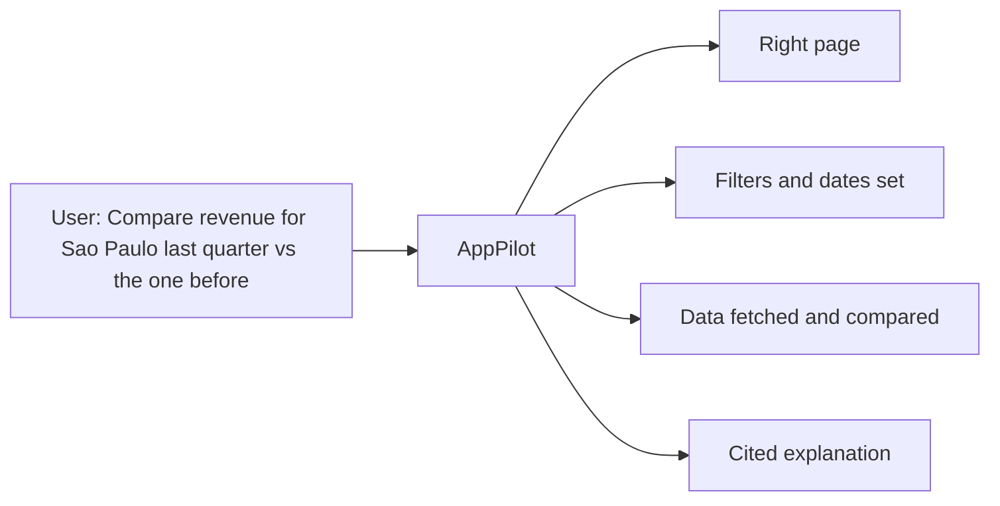
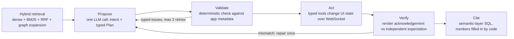
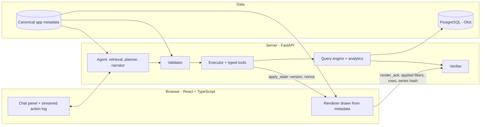
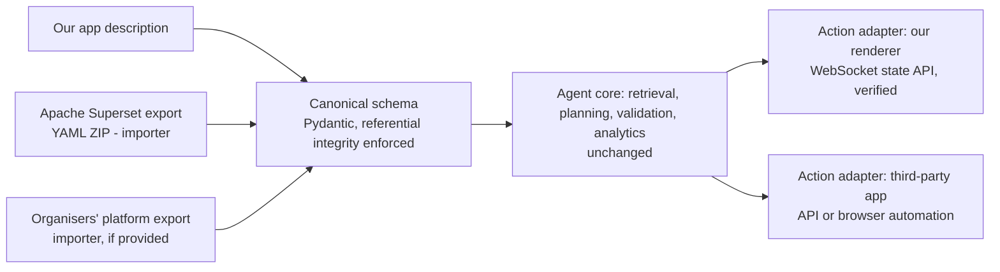
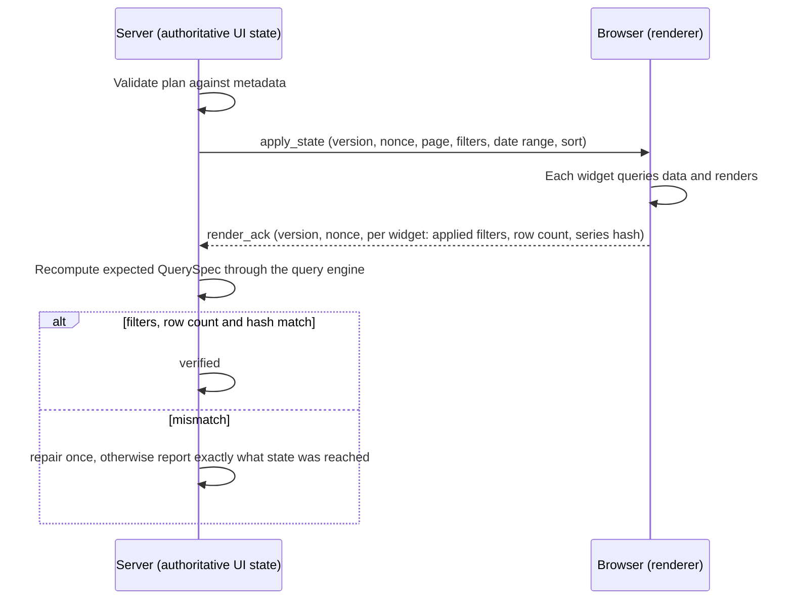
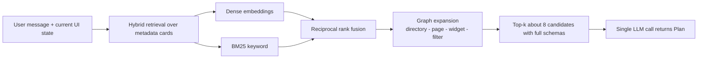
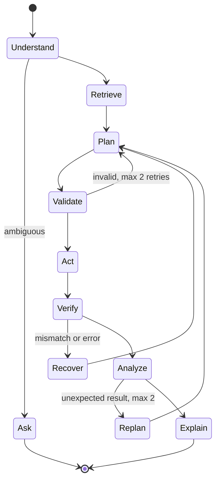

# AppPilot — 5A Context-Aware Application Agent
## Simple Explainer + Slide-by-Slide Content for the Mentor Review

**For:** the team (Praneel, Shashank, Aditya, Shreeniketh) and anyone new who needs to understand the project quickly.
**Events:** mentor review with slides on **9 Oct 2026** · offline round with a **live demo on a local desktop on 11 Oct 2026**.

### How to read the tags
| Tag | Meaning |
|---|---|
| **[RB]** | From the official HackFest rulebook / poster / 5A page |
| **[PUB]** | Published paper or documentation, checked during our research |
| **[SEC]** | Reported by a secondary source (blog, comparison site); check before quoting |
| **[MEM]** | Written from memory, **not verified**; check before using on a slide |
| **[INF]** | Our own decision or opinion |

**Honest status today:** research is done; the shared "contracts" (data formats) are written and pass 31 tests; a detailed work plan exists for each person. **The application, dataset loader and agent are not built yet.** Slides must describe the design and plan, not claim results.

---

# PART A — THE SIMPLE EXPLAINER

## A1. The problem in plain words

Imagine a company uses a big software tool with 100+ pages: sales reports, customer lists, delivery dashboards, each with filters, date ranges and charts. Finding the right page and setting the right filters takes many clicks.

**Problem 5A asks us to build an assistant that lives inside that software.** The user types, "Show me revenue for the South region last quarter and compare it with the quarter before." The assistant should:
1. **Understand** what the user wants.
2. **Go to the right page** and **set the filters** itself (we watch the screen change).
3. **Fetch the data**, calculate the comparison, and **explain** the answer, showing where each number came from.

The rulebook says it must be *more than a chatbot*: it has to act on the application, not just talk. [RB]

## A2. What the judges will check (the official KPIs, in plain words) [RB]

| Official KPI | In plain words |
|---|---|
| Intent-to-destination accuracy | Did it take the user to the **right page**? |
| UI-state correctness | Are the **filters, dates and sorting exactly right**? |
| Multi-step task success, steps, latency | Can it finish tasks that need several steps? How many steps, how fast? |
| Analytical quality | Are the **numbers and explanations correct**, and traceable to a view? |
| Retrieval quality | Among hundreds of pages, does it **find the right ones**? (precision, recall, MRR) |
| Reliability and safety | Does it **never invent actions**? Does it recover from errors? |
| User experience | Can the user finish a task **without clicking around**? Is it useful? |

## A3. Why simple solutions fail

| Approach | What goes wrong |
|---|---|
| **Normal chatbot** | Talks about the app but cannot operate it |
| **RAG** (search the docs, then answer) | Finds text, but cannot set filters or check that anything happened |
| **LLM that clicks the screen (browser agent)** | Brittle. In the WorkArena benchmark (ICML 2024) a GPT-4o agent scored **0.0% on list-filter tasks and 10.0% on list-sort tasks**, 42.7% overall across 33 task types [PUB, checked in the paper's Table 2; a 2024 model, so a baseline, not today's best]. SeeAct reached 51.1% on live websites **only when a human converted its plans into actions** [PUB, abstract]. |
| **LLM with tools, no checking** | Can invent a page, a filter value or a number, and nobody notices |

Sources: [WorkArena](https://arxiv.org/pdf/2403.07718), [SeeAct](https://arxiv.org/abs/2401.01614).

## A4. Our idea in one paragraph

**The AI proposes. Plain code checks.** The language model decides what to do, but it can only choose from a menu built from the app's own description (page names, filter names, allowed values). Before anything runs, strict code **checks** the plan against that description. After it runs, the browser **tells us what it actually showed**, and we compare that with what it should have shown. Finally, every number in the answer comes from a recorded calculation, so each one can be traced.

Three safety nets:
1. **Check before** (validator): no invented pages, filters or values.
2. **Check after** (verifier): the screen really shows the right thing.
3. **Cite everything**: every number points to the query that produced it; if data is missing, it says so.

## A5. Glossary (read this once)

| Term | Plain meaning |
|---|---|
| **No-code platform** | Software where people build apps (pages, tables, charts, filters) by dragging and dropping, without writing code. Examples: Appsmith, Superset. |
| **Metadata** | The *description* of an app: which pages exist, what is on each page, which filters they have, which values are allowed. Like a table of contents plus a spec sheet. |
| **UI state** | What the screen is showing right now: which page, which filters, which date range, which sort. |
| **Intent** | What the user wants (go to a page, set a filter, compare two periods, explain a change...). |
| **Retrieval** | Searching the metadata for the few pages most likely to match the request, instead of showing the AI all 100+ pages. |
| **Semantic layer** | A list of business metrics defined once, e.g. "revenue = sum of price". The AI picks metrics by name instead of writing risky free-form database queries. |
| **Validator** | Code that checks a plan before it runs. |
| **Verifier** | Code that checks, after it ran, that the screen is correct. |
| **Render acknowledgement (ack)** | The browser's report: "I applied these filters, showed this many rows, and the data fingerprint is X." This is what makes verification honest. |
| **Agentic** | The system plans, acts, observes the result, and adapts, instead of answering once. |
| **Importer** | A translator from another platform's export file into our own description format (explained in A7). |
| **Baseline** | A simpler system we compare against to prove ours is better. |
| **Ablation** | Turning one feature off to measure how much it helps. |
| **pass^k** | A reliability score: the chance that a task succeeds **every time** in k repeated runs [PUB, τ-bench]. |

## A6. What we are building — three pillars (plus measurement)

1. **The application** (our own, built from a description file): pages, filters, charts and tables. Built by Aditya (screen) and Shreeniketh (server).
2. **The dataset and metadata** (the foundation): real business data (Olist), its metrics, and the description of ~100–120 pages. Built by Praneel.
3. **The intelligent system** (the agent): understands the request, finds pages, plans, validates, acts, verifies, explains. Built by Shashank, with Shreeniketh's safety layer.
4. **The measurement**: a labelled test set, baselines and results mapped to the KPIs. Praneel and Shashank.

Everything depends on the metadata. The app draws pages from it, the dataset generator creates it, the agent searches and validates against it, and the evaluation scores against it. That is why Praneel builds it first.

**Decision [INF], in line with your plan:** because we don't know whether the organizers will supply a platform and its metadata, **we build our own app, dataset and agent, and evaluate on our own app.** If they later give us theirs, we plug it in, and the agent is built so that it works on it too. How that works is next.

## A7. "Importer" explained simply

**The situation.** Every no-code platform stores its apps in its own file format, the way every country has its own power socket. Our agent understands only **one** format: our own description format (the "canonical schema").

**An importer is a travel adapter.** It reads another platform's export file and rewrites it into our format. The agent never sees the foreign file; it only ever sees our format, so the agent code does not change.

**Example with Apache Superset.** Superset is a free open-source dashboard tool. You can export a dashboard from it as a ZIP file containing several small text files (YAML) describing databases, datasets, charts and dashboards. [PUB: Superset documentation] Our Superset importer would map:

| In Superset | In our format |
|---|---|
| Dashboard | Page |
| Chart | Widget |
| Dataset (table with columns and metrics) | Dataset, fields, metrics |
| Dashboard filters | Filters |

**Why we care.** The mentors said they may give us a platform and its metadata. If so, we write a small importer for *their* format (a few hours) and the same agent runs on their app. Building a Superset importer in advance is a **rehearsal**: it proves our agent is not tied to our own app format. The judges' question, "does it work on a real platform's export?", gets a real answer.

**Two seams, honestly.** Moving to someone else's app has two parts:
1. **Reading their app's description** → the importer. Easy and testable offline.
2. **Pressing the buttons in their app** (navigating, setting filters) → an *action adapter*. For our own app this is direct and verified. For a third-party app we would need its API, or browser automation (Playwright) as a fallback. That part is harder and less reliable. The research above shows why. **The agent's thinking, retrieval, validation and analytics stay the same; only these two adapters change.**

**What we promise today:** it works fully on our app, it reads a foreign export (Superset) through an importer, and it is designed so an adapter for the organizers' platform can be added. We do **not** claim it already operates a third-party UI.

## A8. A request, step by step

User says: *"Compare revenue in São Paulo for last quarter with the quarter before."*

1. **Understand + plan (one AI call):** the system searches the metadata for matching pages and gives the AI only the top ~8 candidates. The AI replies with a typed plan: go to *Revenue by State*, set state = SP, set date range = last quarter, compare periods.
2. **Check before:** the validator confirms the page exists, "SP" is an allowed value, "last quarter" is a valid date preset (resolved against the dataset's last date, since Olist ends in 2018).
3. **Act:** the server tells the browser to show that state; the user watches the page change.
4. **Check after:** the browser reports what it actually showed; the server independently computes what it should have shown and compares them. A mismatch triggers a repair or an honest error.
5. **Analyze:** code (not the AI) computes both quarters, the change and the main contributors.
6. **Explain:** the AI writes the sentence with number placeholders; code fills in the real numbers. Each number shows a citation to its query. The UI shows an action log, a "verified" badge, charts and a deep link.

If something is ambiguous ("show sales"), it asks a question with options. If a request is unsafe or the data is missing, it says so instead of guessing.

## A9. The dataset

The rulebook lists five kinds of data. This is what we provide for each [RB → INF]:

| Rulebook item | What we provide |
|---|---|
| Application metadata (hierarchy, pages, widgets, schemas) | `application.json` with ~100–120 generated pages across 7 modules |
| Component and UI-state definitions (filters, dates, sort, routes) | Filter definitions with allowed values and synonyms; one UI-state format |
| Underlying business data | **Olist Brazilian e-commerce**: real, anonymised, ~100k orders from 2016–2018 in 9 tables [PUB, via search] |
| Natural-language request corpus with intent and slot labels | Our own benchmark, **AppBench-5A**: ~200 tasks at 6 difficulty levels, with correct actions, correct final screen state and correct answers |
| Public grounding / benchmarks | A small BIRD sample for text-to-SQL sanity checks; τ-bench scoring ideas; the WorkArena task types as a model |

Why Olist: it is real data with real seasonality, so "why did revenue change?" has real answers, and the right answers can be computed with SQL. **Check the license on its Kaggle page** (I believe non-commercial, but this was not verified). It has no inventory or finance-ledger tables, so our modules are Sales, Customers, Sellers, Logistics, Payments, Reviews, Catalog.

## A10. How we will measure ourselves

| Official KPI | How we measure it |
|---|---|
| Destination accuracy | % of tasks ending on the correct page |
| UI-state correctness | % of filters/dates/sorts correct; % of tasks with the **entire** screen state exactly right |
| Multi-step success | % of multi-step tasks fully correct; steps; time; pass^k |
| Analytical quality | Numbers within tolerance of correct SQL; correct direction of change; % of numbers with a citation |
| Retrieval quality | Precision@k, Recall@k, MRR over ~120 pages |
| Reliability and safety | % of plans containing invented pages/values (before and after the validator); % of unsafe or out-of-scope requests handled correctly; recovery rate on injected faults |
| User experience | Tasks completed with no manual navigation; clarification rate |

**Systems we compare** (same AI model for all): B0 simple search that returns a link · B1 all page descriptions stuffed in the prompt · B2 retrieval plus tools but no validator or verifier · **Ours**.

**Experiments that turn one feature off:** no validator · no verifier · vector-only retrieval · raw SQL instead of the semantic layer · no repair loop · a different AI model. Each shows how much that feature contributes. We report averages with confidence intervals and are honest about weak spots.

## A11. Technology (simple)

| Part | Choice | Why |
|---|---|---|
| Screen | React + Vite + TypeScript, Recharts, TanStack Table | Fast to build; one component per widget type |
| Server | Python, FastAPI, WebSocket | Typed data models are shared with the AI side |
| Database | PostgreSQL | Real SQL for analytics |
| Search | Embeddings + keyword search + a small page graph | Measurable retrieval quality |
| SQL safety | sqlglot | Parses and restricts queries to read-only SELECTs |
| AI model | **Gemini via the free API** (plan in A12), behind one adapter file so the model can be swapped | Your preference; free |
| Agent framework | Plain Python | Easier to debug in a few days |
| Tests | pytest, Playwright | Contracts and end-to-end |

### Using Gemini's free tier — what to know
- Search results report, for the Gemini 2.5 Flash free tier, about **10 requests per minute and 250 per day**, and for Flash-Lite about **30 per minute and 1,000 per day**. Google says limits change and should be checked in AI Studio. [SEC]
- Structured output with a Pydantic schema is supported by the `google-genai` Python SDK. [SEC] Gemini accepts only a **subset of JSON schema** [MEM], so **test our `Plan` schema against Gemini on day 1**; we may need to simplify it.
- **The catch:** a full evaluation (~140 test tasks × 3 runs × several systems and ablations) would need thousands of calls, far above a 250/day limit [INF estimate]. Mitigations: (1) cache every call on disk; (2) use Flash-Lite for bulk runs; (3) run 3 repeats only for the main comparison and 1 for ablations; (4) keep a small paid budget or a local model (e.g. Ollama) as a fallback, and **say which model produced which numbers**; (5) check Google's terms before sharing one key or creating extra accounts.
- **Demo safety:** with the cache plus a fallback model, the demo still works if the internet drops.

## A12. Timeline from now to the 11 Oct demo [INF]

| When | Goal |
|---|---|
| **8 Oct (tonight)** | Everyone reads their file; repo on GitHub; Praneel downloads Olist; Shashank gets a Gemini key and tests the `Plan` schema; Aditya sets up Node and the app skeleton; Shreeniketh sets up Docker/Postgres/FastAPI |
| **9 Oct** | Mentor review with slides. Rest of the day: foundations and the first end-to-end round trip (server pushes a state, browser acknowledges, hashes match) |
| **10 Oct** | Deterministic spine (validator, executor, verifier), the real AI planner, analytics. Evening: **feature freeze** and a **fresh-clone dry run on the demo desktop** |
| **11 Oct (morning)** | Evaluation runs as far as possible, rehearsal, backup recording. Live demo |

**This is tight.** If things slip, we cut breadth and keep the heart of the project. The "demo ladder", from must-have to nice-to-have:

| Level | What the demo shows |
|---|---|
| A (must) | App renders ≥ 50 pages from metadata; the agent navigates and sets filters/dates; visible check after action; refusal of bad requests |
| B | Analytics: compare periods, "largest contributors" explanation, cited numbers |
| C | KPI results table on our test set, vs. baselines |
| D | Superset importer result; ablations; second-source portability |

## A13. Honest risks and limits

| Risk | Why it matters | What we do |
|---|---|---|
| Very little build time | Two and a half days | Contracts and plans are done; ladder above; daily integration |
| Gemini free-tier limits | Slows evaluation | Cache, Flash-Lite, small paid fallback |
| Olist license/columns unverified | Could force a different dataset | Praneel checks first; Northwind fallback |
| Our "no-code app" is our own renderer | Mentors may expect a real platform | Be upfront; importer; ask them |
| Verifier shares the query compiler | A compiler bug would not be caught by the ack check | Independent hand-written SQL on ~30 tasks |
| Novelty | Schema-based validation of tool calls already exists in recent papers | We claim only: tool contracts generated from app metadata, rendered-state verification, cited analytics, a benchmark |
| Research depth | We read paper abstracts and summaries, not every paper in full | Re-check any number before it goes on a slide |

## A14. Where to develop: workstation vs your local PC

**Recommended: GitHub is the single source of truth. Nobody ping-pongs ZIP files.**

1. Create a **private GitHub repo** tonight and push the current `apppilot/` folder from this workstation (I can run `git init` and make the first commit here if you ask; you add the remote and push).
2. Teammates `git clone` it and work on short branches; merge to `main` at least daily.
3. The demo desktop does `git clone` + `git pull`. It never gets hand-copied files.
4. Keep these **out of git**: the Olist CSVs and any API keys (`.env`). Commit a `.env.example`, a data download script (or share the CSVs through a drive), and a one-command start (`docker compose up` plus a load script).
5. **Rehearse a fresh clone on the demo desktop by the evening of 10 Oct**, not on the morning of 11 Oct. It must: install, load data, start, and run one scripted demo.
6. Check now what the demo desktop has: OS, Python 3.12, Node 20+, Docker (Docker Desktop on Windows needs setup time), internet access at the venue. If Docker is impossible there, tell us now and we choose another way to run Postgres.
7. Pre-download the embedding model and cache LLM responses so the demo does not depend on the network.

**Developing on your local PC, with me guiding, is also fine,** as long as the code lives in git. The risk is not "where" but two diverging copies. Use the workstation, the local PC, or both, but always commit and pull.

---

# PART B — SLIDE-BY-SLIDE CONTENT

**How this part is written.** Slides about the *problem* (2–4, 6) stay in plain words. Slides about the *approach and contributions* (5, 7–11, 14–16, 19) use precise technical terms, because mentors will judge the design on them. Every technical slide has a **Plain line**: one sentence that translates the jargon for a non-technical listener. **Say** is what to speak (do not put it on the slide). **If asked** holds deeper answers.

**Core path = slides 1–13 (about 13–15 minutes).** If you only get ~8 minutes, show **1, 2, 4, 5, 7, 9, 10, 13**. **Appendix = slides 14–21** (use for questions). Diagrams are Mermaid: render them at mermaid.live or the VS Code preview and paste them as images, or redraw the boxes in PowerPoint.

**Rules for the slides [INF]:** show only numbers we have checked (WorkArena and SeeAct below) or will have measured; label expected results as hypotheses; say the known limits ourselves.

---

## CORE SLIDES

### Slide 1 — Title
**On the slide**
- **AppPilot**
- A context-aware agent that navigates, operates and analyses a no-code application — with every action validated and every number cited
- KLE Tech HackFest 2026 · Domain 5 · Problem Statement 5A
- Team: Praneel, Shashank, Aditya, Shreeniketh · KLE Technological University *(add logos, branch, team name)*

**Say (20 s):** "We are building an assistant that lives inside a business application, understands its pages and filters, and operates it through natural language — safely and verifiably."

---

### Slide 2 — The problem *(plain)*
**On the slide**
- Title: **Business apps are deep. Users lose time clicking.**
- Left: 100+ pages · filters · date ranges · charts · grids
- Right: Ask in plain English → the app moves, filters, calculates and explains
- Bottom: *Official ask [RB]:* understand the app · navigate · set filters and UI state · retrieve and combine data · analyse (trends, period comparisons, likely causes) · answer in context

**Diagram:**

**Say (40 s):** The brief: go beyond a chatbot. The assistant must act on the app and analyse the data.

---

### Slide 3 — What success means: the official KPIs *(plain)*
**On the slide**
| KPI [RB] | What it checks |
|---|---|
| Intent-to-destination accuracy | Lands on the right page |
| UI-state correctness | Filters, dates and sorts exactly right |
| Multi-step task success, steps, latency | Chains of actions; how many steps, how fast |
| Analytical quality and faithfulness | Correct numbers, traceable to a view |
| Retrieval quality (precision / recall / MRR) | Finds the right page among hundreds |
| Reliability and safety | Near-zero invented actions; recovers from errors |
| User experience | Task done without manual navigation |

Footer: *Every KPI becomes a number we measure (slide 11).*
**Say (40 s):** We organised the project around these seven KPIs; every component exists to move one of them.

---

### Slide 4 — Why existing approaches fall short *(plain, with evidence)*
**On the slide**
| Approach | Failure |
|---|---|
| Chatbot | Cannot operate the app |
| RAG | Finds text; cannot set or verify UI state |
| LLM that reads/clicks the screen (browser agent) | WorkArena (ICML 2024): GPT-4o agent scored **0.0 %** on list-filter and **10.0 %** on list-sort tasks; 42.7 % overall |
| LLM + tools, unchecked | Can invent pages, filter values or numbers |

Source line: WorkArena, arXiv 2403.07718 · SeeAct, arXiv 2401.01614 (51.1 % on live sites only when a human grounded the plans).
**Say (60 s):** Filters and sorting are exactly what our KPIs score, and screen-driving agents fail at them. So we do not let the AI click the screen. We make it choose from a menu built from the app's own description, and we check the result.
**If asked:** the WorkArena agent is a 2024 model; we cite it as a baseline for the *approach*, not as today's best model. The numbers are from the paper's Table 2 (GPT-4o, 33 task types).

---

### Slide 5 — Our approach: propose → validate → act → verify → cite *(technical)*
**On the slide**
- Title: **The LLM proposes. Deterministic code validates, acts, verifies — and every number is cited.**

**Diagram:**

- **Propose:** one structured-output LLM call returns *intent + a typed plan* (Pydantic / JSON-schema). Tool arguments are drawn from enums built from the app metadata — a closed vocabulary.
- **Validate:** a deterministic validator (symbolic guardrail) checks every step before execution: tool allow-list, id existence, filter operator and value membership after synonym resolution, date presets resolved against the dataset's `as_of_date`.
- **Act:** typed tools update the **UI state** (route, filters, date range, sort) through a versioned WebSocket protocol.
- **Verify:** the browser returns a **render acknowledgement**; the server compares it with an expectation it computed independently.
- **Cite:** metrics come from a **semantic layer** (named SQL definitions); an LLM writes the sentence with placeholders and *code* fills in the numbers.

**Plain line:** *The AI fills in a fixed form instead of writing free text; plain code checks the form before it runs and checks the screen after it runs.*
**Say (75 s):** One picture, three safety nets: check before, check after, cite everything. The AI never writes a URL, a filter value or a number on its own.
**If asked "is that agentic?":** yes — it plans, acts on a live application, observes the verified result, and replans within bounds (slide 15).

---

### Slide 6 — What the user sees *(plain)*
**On the slide:** a mock screenshot with three areas: left navigation tree · centre page with chart and grid · right chat panel with an **action log** and a **✓ verified** badge.
- User: "Compare revenue for São Paulo last quarter with the quarter before."
- Action log: `Intent: compare_periods` → `Page: Revenue by State` → `Filter: state = SP` → `Date: 2018-04-01 … 2018-06-30` → `✓ screen matches expected`
- Answer with citation chips; controls: **Undo** · **Confirm mode** toggle · **deep link**

**Say (60 s):** The user watches the app operate itself and sees each step. In confirm mode every change shows an approval card first; in default mode every change can be undone.
*(Mock only. Do not print real numbers until we have measured results.)*

---

### Slide 7 — System architecture *(technical)*
**Diagram:**

**On the slide (one line per box):**
- **Canonical metadata** — one typed description of the app (modules, pages, widgets, datasets, fields, filters, metrics, routes) that drives the renderer, the retrieval index, the tool schemas and the validator
- **Query engine** — semantic-layer metrics → parameterised SQL, checked with an AST parser (single `SELECT`, allow-listed tables/columns), run as a **read-only** database role with a statement timeout
- **Executor** — typed tools for navigate / filter / date range / sort / read / query; undo stack; optional confirm mode
- **Verifier** — compares the browser's acknowledgement with the independently computed result

**Plain line:** *One description of the app drives the screen, the AI and the safety checks.*
**Say (75 s):** Everything hangs off the metadata. That is why we built it first and why a new app only needs a new importer.

---

### Slide 8 — Metadata first: works on any app *(technical)*
**Diagram:**

**On the slide**
- **Canonical schema** with load-time **referential-integrity** checks: a malformed export is rejected before the agent ever sees it
- **Importer** = a translator from a platform's export into the canonical schema (e.g. Superset: dashboard → page, chart → widget, dataset → dataset/fields/metrics, native filter → filter)
- **Tool contracts are generated from the metadata** (argument enums, filter vocabularies, validators) — change the metadata and the contract changes with it
- **Today:** full on our own app · Superset importer as a portability test · **If the organisers supply a platform:** write its importer (+ an action adapter) — agent logic does not change
- **Honest limit:** an importer proves we can *read* a foreign export; *operating* a third-party UI needs the action adapter (API or browser automation), which we do not claim yet

**Plain line:** *An importer is a travel adapter: it turns any platform's file into the one format our agent understands.*
**Say (75 s):** We don't yet know whether a platform will be provided, so we built for both cases.
**If asked "do you operate real Superset?":** No. We read its export format; we claim portability of the *description*; the action adapter is the next step.

---

### Slide 9 — Verification: what the screen *really* showed *(technical)*
**Diagram:**

**On the slide**
- The **server is authoritative** for UI state; the browser **acknowledges what it actually did**
- Per widget the acknowledgement carries: the **filters it actually sent in its data request**, the **row count**, and a **series hash** (SHA-256 of the canonically serialised displayed rows; the same function runs in Python and TypeScript, checked with shared test vectors)
- The verifier recomputes the expected query independently and compares filters, row count and hash
- **Why this is not circular:** a design that re-reads the same state store the executor just wrote can only catch write bugs. This compares what was *rendered* with what *should have been* rendered.
- **Known limit (say it first):** both sides use the same query compiler, so a compiler bug is invisible to this check — we cross-check ~30 answers against independent hand-written SQL

**Plain line:** *The screen reports what it really showed, and we compare that with what it should have shown.*
**Say (75 s):** This answers the obvious judge question: "how do you know it worked?"
**If asked "what if the browser lies or a widget never loads?":** the acknowledgement has a timeout and an `error` field; the agent reports the state it actually reached instead of guessing.

---

### Slide 10 — Our contributions and how we prove them *(technical, honest)*
**On the slide**
| # | Contribution | How we demonstrate it |
|---|---|---|
| C1 | **Metadata-derived action contract:** tool schemas, argument vocabularies and validators generated from the app's metadata export | Run the same agent on a **Superset-imported** app with no agent code changes; report retrieval and validation metrics on it |
| C2 | **Rendered-state verification:** client-side acknowledgement (applied filters, row count, series hash) compared with an independently computed expectation | **Fault-injection** (drop a filter, empty widget) + ablation *no verifier*: detection and recovery rate |
| C3 | **Provenance-by-construction analytics:** semantic-layer SQL, contribution decomposition on additive metrics, numbers inserted by code through placeholders, refusal on missing data | **Citation faithfulness** (% numbers traceable), numeric accuracy vs hand-written SQL, ablation *no citation check* |
| C4 | **AppBench-5A:** a KPI-aligned benchmark scored by *final-state comparison* | Baselines B0–B2 and ablations on the frozen test split |

**What we do *not* claim:** that schema validation of tool calls is new (related guardrail work exists: ToolSafe and others) · that "largest contributors" are causes · that we operate third-party UIs.
**Builds on:** ReAct (plan–act–observe), CRITIC (correct using an *external* signal), τ-bench (state-based scoring, pass^k).

**Plain line:** *We take known ideas — typed plans, guardrails, self-correction — and apply them end to end to operating an application, with measurable checks.*
**Say (75 s):** Each contribution is paired with an experiment. If an experiment fails we report it.

---

### Slide 11 — Evaluation: every KPI becomes a number *(technical)*
**On the slide**
| Official KPI [RB] | Metric |
|---|---|
| Intent-to-destination accuracy | intent accuracy; **top-1 destination accuracy** |
| UI-state correctness | **slot-level F1** over (filter, operator, values), date range and sort; **full-state exact match** |
| Multi-step success, steps, latency | task success on L5 tasks; mean steps; p50 / p95 latency; **pass^k** = mean over tasks of C(c,k) / C(n,k) (c successes in n runs) |
| Analytical quality, faithfulness | numeric match vs gold SQL (tolerance); direction-of-change correct; **citation faithfulness** = cited numbers ÷ numbers shown |
| Retrieval quality | **P@k, R@k, MRR** over ~120 pages |
| Reliability and safety | **action-hallucination rate** = plans with ≥ 1 invalid id/value ÷ plans, measured *before* and *after* the validator; refusal accuracy on edge cases; recovery rate under injected faults |
| User experience | tasks finished without manual navigation; clarification rate |

- **Scoring:** final-state comparison (τ-bench style) on the frozen test split; gold actions, gold final UI state and gold answers are generated from SQL
- **Baselines (same LLM, same prompt effort):** B0 embedding search → link · B1 all page descriptions in the prompt · B2 RAG + tools, **no validator/verifier** · **Ours**
- **Ablations:** no validator · no verifier · vector-only vs hybrid + graph retrieval · raw SQL vs semantic layer · no repair loop · other LLM
- **Statistics:** 3 runs per task for the main comparison, **95 % bootstrap confidence intervals**; we state which model produced which number
- *Expected improvements are hypotheses; we report whatever we measure.*

**Plain line:** *We compare ourselves against simpler systems and switch our own features off one by one to see what each one is worth.*
**Say (75 s).**

---

### Slide 12 — Roadmap, deliverables and expected outcomes *(plain)*
**Roadmap to the 11 Oct live demo** (four-column graphic):
| 8 Oct | 9 Oct | 10 Oct | 11 Oct |
|---|---|---|---|
| Foundations: data, metadata, repo | Mentor review; first server ↔ browser round trip | Safety layer, AI planner, analytics; feature freeze; fresh-clone rehearsal | Evaluation runs, rehearsal, live demo |

**Deliverables:** working app drawn from metadata · agent with validator and verifier · KPI results on our benchmark · Superset importer · documentation and demo.
**Expected outcomes (hypotheses):** higher destination and screen-state accuracy than RAG + tools without checks · far fewer invented actions reaching the screen · recovery from injected faults · honest refusal when data is missing.
**Say (60 s):** We are early, and we will say exactly what is done at each stage.

---

### Slide 13 — Questions for you, and our main risks *(plain)*
**Questions for the mentors**
1. Will a no-code platform or metadata export be provided? If yes, which format?
2. Is our own metadata-driven app acceptable if none is provided?
3. What must the 11 Oct demo show, and for how long?
4. Is there a test set or scoring rubric we should align to?
5. Are LLM API credits provided, or may we use free tiers?
6. Anything you would add or avoid?

**Risks → what we do:** short build time → staged demo plan · free-tier LLM limits → response cache, small fallback · dataset licence → verify before use · own app instead of a real platform → importer, and we ask you.
**Say (45 s):** We would rather align with you now than discover a mismatch later.

---

## APPENDIX SLIDES

### Slide 14 — Retrieval and planning, in detail *(technical)*
**Diagram:**

**On the slide**
- One text card per page, widget and filter field (title, description, keywords, parent path); **only the top-k candidates with their schemas enter the prompt** — prompt size is independent of app size
- **Hybrid retrieval:** dense sentence embeddings + BM25, merged by **reciprocal rank fusion**, then **graph expansion** to siblings and parent directories; we measure each stage (P@k, R@k, MRR) and ablate it
- **One structured-output call** returns `Plan = {intent, steps[], clarifying_question?, allow_replan}`; each step is a typed `ToolCall` with an `expect` post-condition the verifier will check
- Relative dates are emitted as **preset strings** (e.g. `last_quarter`) and resolved by deterministic code against the dataset's `as_of_date`
- Tool outputs and data cells are treated as **data, never instructions** (prompt-injection hygiene)

**Plain line:** *Instead of showing the AI 100+ pages, we search first and show it only the best eight.*

### Slide 15 — Agent loop and guardrails *(technical)*
**Diagram:**

**On the slide**
- **Planner–executor** pipeline with an LLM at two points only (plan, narrate) — low latency, debuggable
- **Bounded autonomy:** ≤ 2 plan retries on validator issues; ≤ 2 replans after read-only analytic observations; 1 tool retry; then ask the user or report exactly what state was reached
- **Typed error taxonomy:** invalid reference · invalid value · state mismatch · query failed · empty result · timeout · denied
- **Guardrails:** tool allow-list; read-only database role; **confirm mode** (approval before every state change) or auto-run with undo; refusal of unsafe or out-of-scope requests; missing data is stated, never estimated
- Action log streams as events (`understanding`, `retrieval`, `plan`, `validation`, `action`, `verify`, `evidence`, `answer`) so the user sees progress immediately

**Plain line:** *It plans, acts, checks, and adapts — but only within limits, and it asks when unsure.*

### Slide 16 — Data, semantic layer and analytics with provenance *(technical)*
**Diagram:** `metric names → semantic layer (named SQL definitions) → parameterised, AST-checked, read-only SQL → Evidence objects (values + query) → LLM writes text with placeholders → code substitutes numbers → cited answer`
**On the slide**
- **Olist** public e-commerce data: ~100k orders, 9 tables, 2016–2018 [source: Kaggle]; denormalised fact tables; modules: Sales, Customers, Sellers, Logistics, Payments, Reviews, Catalog
- **Semantic layer:** metrics (revenue, orders, average order value, late-delivery rate, …) defined once with `additive` flags
- **Deterministic analytics:** period comparison (calendar-aware previous period), trends, `explain_change` = **contribution decomposition** (member Δ ÷ total Δ) for **additive** metrics only; ratios get per-dimension deltas, not contribution shares
- Output is phrased as **"largest contributors to the change"** — never as causes
- **Provenance by construction:** every number in an answer is an `Evidence` field inserted by code; a digit that did not come from a placeholder is rejected

**Plain line:** *The AI never does arithmetic: code calculates, and every number carries its source.*

### Slide 17 — The dataset we create (maps to the rulebook) *(plain)*
| Rulebook item [RB] | What we provide |
|---|---|
| Application metadata | `application.json`: ~100–120 generated pages across 7 modules |
| Component and UI-state definitions | Filter definitions with allowed values and synonyms; one UI-state format |
| Underlying business data | Olist e-commerce data in PostgreSQL |
| Natural-language request corpus with intent and slot labels | **AppBench-5A**: ~200 labelled tasks (slide 18) |
| Public grounding and benchmarks | BIRD sample for SQL checks; τ-bench scoring ideas; WorkArena task types |

*Templates + real data → ~100–120 pages, each with a retrieval-friendly description.*

### Slide 18 — Our benchmark: AppBench-5A *(plain)*
| Level | Example |
|---|---|
| L1 navigate | "Open the delivery dashboard" |
| L2 navigate + one setting | "Orders last month sorted by value" |
| L3 several settings | "Customers in SP, last 90 days" |
| L4 analysis on one view | "Revenue trend by month this year" |
| L5 multi-step analysis | "Why did revenue fall last quarter?" |
| L6 edge cases | ambiguous · out of scope · missing data · destructive · unknown value |

~60 development tasks and ~140 frozen test tasks (≥ 30 edge cases). Gold actions, final UI state and answers come from SQL; ~30 answers are cross-checked with independent hand-written SQL; utterances are paraphrased separately; the test split is hand-checked and never used for tuning.

### Slide 19 — Research foundation *(technical)*
| Work | What we take from it |
|---|---|
| ReAct (ICLR 2023) | Interleaved reasoning and acting loop |
| CRITIC (ICLR 2024) | Correct outputs using an **external** verification signal |
| τ-bench (2024) | Score by **final-state comparison**; **pass^k** reliability |
| WorkArena (ICML 2024) | Enterprise UI task types; evidence that raw-screen agents fail on list filter/sort |
| SeeAct / Mind2Web (ICML 2024 / NeurIPS 2023) | Grounding to page elements is the bottleneck |
| BIRD (NeurIPS 2023) | Supplying business definitions ("evidence") to text-to-SQL helps |
| Gorilla / ToolLLM | Retrieve tool and API descriptions at run time |
| ToolSafe and related guardrail work | **Related work:** schema/argument checks on tool calls already exist |

Links: [ReAct](https://arxiv.org/abs/2210.03629) · [CRITIC](https://arxiv.org/pdf/2305.11738) · [τ-bench](https://arxiv.org/pdf/2406.12045) · [WorkArena](https://arxiv.org/pdf/2403.07718) · [SeeAct](https://arxiv.org/abs/2401.01614) · [BIRD](https://neurips.cc/virtual/2023/poster/73529) · [Gorilla](https://ar5iv.labs.arxiv.org/html/2305.15334) · [ToolSafe](https://arxiv.org/html/2601.10156v1)
**If asked "what's new?":** see slide 10. We do not claim schema validation itself; we claim the end-to-end combination for application operation, with rendered-state verification and a benchmark.

### Slide 20 — Technology stack *(technical)*
| Layer | Choice |
|---|---|
| Frontend | React + Vite + TypeScript, Recharts, TanStack Table, Zustand |
| Backend | Python, FastAPI, Pydantic, WebSocket |
| Data | PostgreSQL; sqlglot for SQL AST validation; read-only role |
| Retrieval | Sentence embeddings + BM25 + reciprocal rank fusion + networkx graph |
| LLM | Gemini (free API) behind a provider-agnostic adapter, with a disk response cache and rate limiter |
| Agent | Plain Python planner–executor (no heavy framework) |
| Testing | pytest, Playwright, shared hash test vectors |

*The model sits behind one adapter, so we can switch providers.*

### Slide 21 — Honest limits *(plain)*
- Verifier shares the query compiler with the data path → cross-checked against independent SQL
- Results will come from one public dataset and our own app renderer (plus an importer test), not a live third-party platform
- Free-tier LLM limits constrain how many evaluation runs we can afford; we will state which model produced which number
- Schema-based validation of tool calls already exists in the literature; we claim the combination and the measurements, not the idea alone
- We read papers' abstracts and key tables, not every paper in full; numbers on slides are checked or labelled as hypotheses

---

## Presentation tips [INF]
- Open with the evidence (slide 4) and the idea (slide 5); a clear idea is remembered longer than a list.
- On technical slides, read the **Plain line** first, then the technical bullets.
- Say the limits yourselves (slides 9, 10, 21). It builds trust.
- Do not show numbers you have not measured.
- Rehearse once with a timer; keep the core path to about 13 minutes (or use the 8-minute cut).
